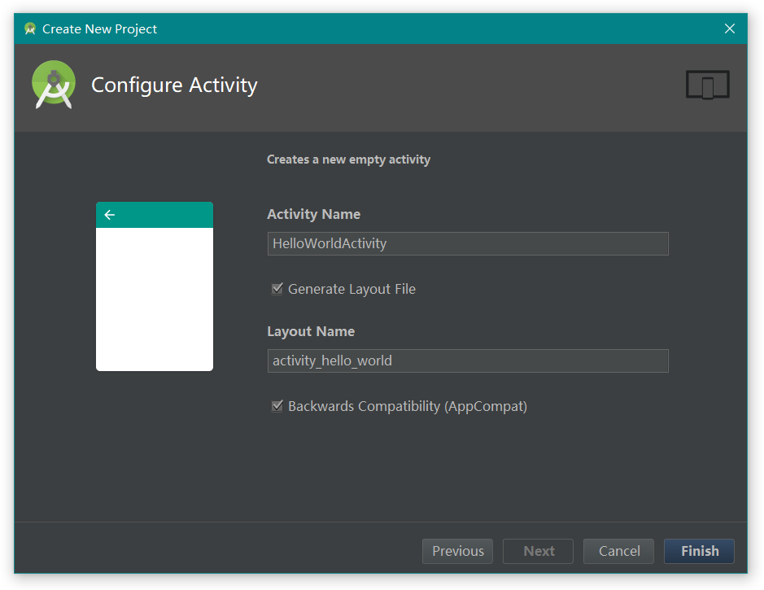
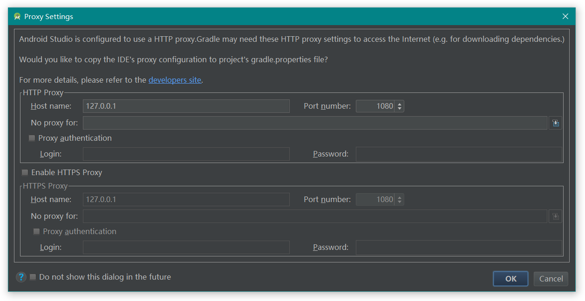

# 问候世界

以HelloWorld为例，简述AS的使用。

## 新建项目

打开Android Studio，选择Start a new Android Studio project。

**Create Android Project**：

* Application name：应用名称

* Company domain：公司域名

* Project location：项目位置

* Package name：包名

**Target Android Devices**：

在该项中选择项目的最低兼容版本。

**Add an Activity to Mobile**：

**Configure Activity**：

---

如有必要，可以单独的对每一个项目设置代理

