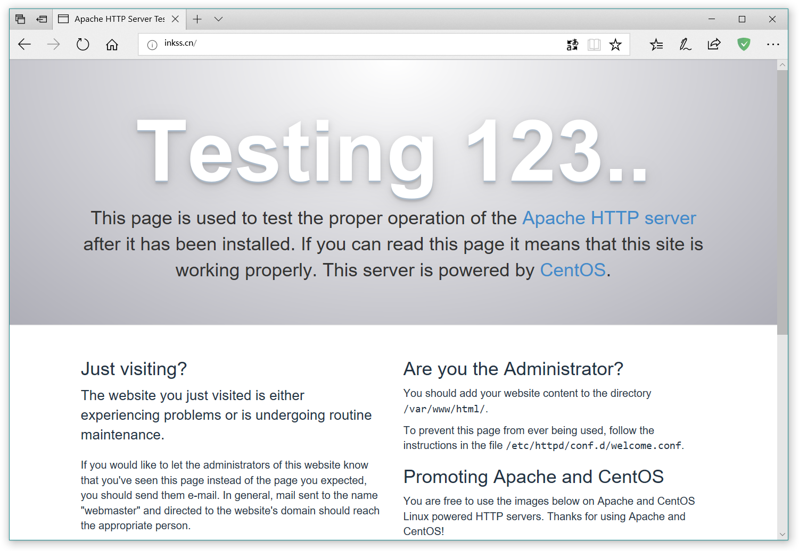
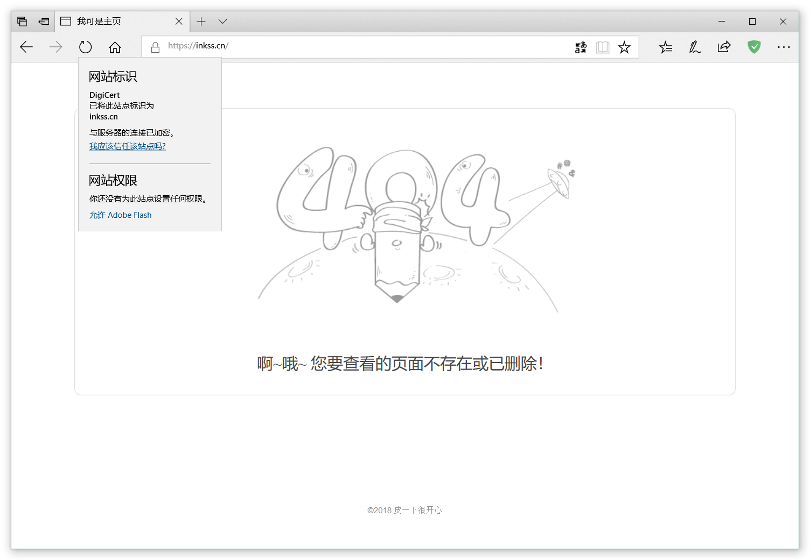

# CentOS PHP 环境配置 [LAMP]

> 平台：腾讯云
>
> 主机：标准型 S2 1核 2GB 50GB 1Mbps
>
> 操作系统：CentOS 7.4 64 位

## 1.连接服务器

* SSH 类软件：[XShell 5](https://www.netsarang.com/products/xsh_overview.html)

* FTP 类软件：[XFtp 5](https://www.netsarang.com/products/xfp_overview.html)

  这两个软件作为一家公司的产品，好处是可以互相调用。对于家庭/学生用户，可以申请免费产品。

注：Xshell 如果出现“*所选的用户密钥未在远程主机上注册。请再试一次*”这类提示，主要原因是登录名不正确造成的，对于的腾讯云的基础镜像，CentOS 的登录名为 root，Ubuntu 的登录名为 ubuntu。

## 2.安装 Apache

（1）安装 Apache 服务

```ssh
yum install httpd
```

（2）开启 Apache 服务

```ssh
systemctl start httpd.service
```

（3）设置 Apache 服务开机启动

```ssh
systemctl enable httpd.service
```

（4）测试验证

在浏览器中输入服务器 IP 地址（或域名），如果能打开 Apache 的测试网页则代表成功。



## 3.安装 MySQL（MariaDB）

（1）安装MySQL服务

```ssh
yum install mariadb mariadb-server.x86_64
```

（2）开启 MySQL 服务

```ssh
systemctl start mariadb.service
```

如果启动失败，安装缺失的依赖包，执行下列命令。

```ssh
yum install mariadb‐bench mariadb‐devel mariadb‐embedded mariadb‐libs mariadb mariadb‐server
```

（3）设置 MySQL 服务开机启动

```ssh
systemctl enable mariadb.service
```

（4）设置 root 账户密码（初始密码为空）

```ssh
mysql_secure_installation
```

（5）测试验证

登录 MySQL 验证是否能正常进入。

```ssh
mysql -u root -p
```

## 4.安装 PHP

（1）安装 PHP 服务

```ssh
yum install php
```

（2）安装 PHP 的 MySQL 扩展

```ssh
yum install php-mysql
```

（3）安装其他常用 PHP 模块

```ssh
yum install php‐gd php‐ldap php‐odbc php‐pear php‐xml php‐xmlrpc php‐mbstring php‐snmp php‐soap curl curl‐devel php‐imap
```

（4）重启 Apache 服务

```ssh
systemctl restart httpd.service
```

（5）测试验证

使用Vim新建一个 php 页面

```ssh
vim /var/www/html/info.php
```

文件内容如下：

```php
<?php phpinfo(); ?>
```

保存之后，使用浏览器访问 /info.php 页面，如果能显示 PHP 的信息，则验证成功。


## 5.安装 PhpMyAdmin

（1）安装

```ssh
yum install phpmyadmin php-mcrypt
```

同时会在 Apache 的配置文件目录中自动创建虚拟主机配置文件 /etc/httpd/conf.d/phpMyAdmin.conf（区分大小写）。默认情况下，CentOS 上的phpMyAdmin只允许从回环地址(127.0.0.1)访问。

（2）配置远程访问

修改配置文件

```ssh
vim /etc/httpd/conf.d/phpMyAdmin.conf
```

文件内容更改如下：

```vim
<Directory /usr/share/phpMyAdmin/>
   AddDefaultCharset UTF-8

   <IfModule mod_authz_core.c>
     # Apache 2.4
     <RequireAny>
   #    Require ip 127.0.0.1   # 注释掉
   #    Require ip ::1         # 注释掉
        Require all granted    # 新添加
     </RequireAny>
   </IfModule>
   <IfModule !mod_authz_core.c>
     # Apache 2.2
     Order Deny,Allow
     Deny from All
     Allow from 127.0.0.1
     Allow from ::1
   </IfModule>
</Directory>

<Directory /usr/share/phpMyAdmin/setup/>
   <IfModule mod_authz_core.c>
     # Apache 2.4
     <RequireAny>
   #    Require ip 127.0.0.1   # 注释掉
   #    Require ip ::1         # 注释掉
        Require all granted    # 新添加
     </RequireAny>
   </IfModule>
   <IfModule !mod_authz_core.c>
     # Apache 2.2
     Order Deny,Allow
     Deny from All
     Allow from 127.0.0.1
     Allow from ::1
   </IfModule>
</Directory>
```

重启 Apache 服务器

```ssh
systemctl restart httpd.service
```

（3）测试验证

使用浏览器访问 IP/phpmyadmin 页面，如果能正常打开登录，则验证成功。


## 6.配置 Https 链接

（1）安装 SSL

```ssh
yum install mod_ssl openssl
```

（2）安装证书

下载证书文件并上传到服务器中，修改配置文件

```ssh
vim /etc/httpd/conf.d/ssl.conf
```

修改对应字段内容：

```vim
ServerName www.domain.com # 配置域名
SSLEngine on
SSLCertificateFile /usr/local/apache/conf/2_www.domain.com_cert.crt # 证书公钥
SSLCertificateKeyFile /usr/local/apache/conf/3_www.domain.com.key   # 证书私钥
SSLCertificateChainFile /usr/local/apache/conf/1_root_bundle.crt    # 证书链
```

重启 Apache 服务器

```ssh
systemctl restart httpd.service
```

（3）配置全站 Http 转 Https

3.1 修改配置文件

```ssh
vim /etc/httpd/conf/httpd.conf
```

修改 AllowOverride 字段值:

```vim
<Directory "/var/www/html">
  ...
  AllowOverride All  # 原来是 None，需要改成 All
  ...
</Directory>
```

3.2 在 80 端口的网站根目录 /var/www/html 下新建文件

```ssh
vim /var/www/html/.htaccess
```

添加文件内容：

```vim
RewriteEngine on
RewriteBase /
RewriteCond %{SERVER_PORT} !^443$
RewriteRule ^.*$ https://%{SERVER_NAME}%{REQUEST_URI} [L,R]
```

重启 Apache 服务器

```ssh
systemctl restart httpd.service
```

（4）测试验证

浏览器输入 http 开头的域名，观察浏览器地址是否跳转为 https 链接。



---

参考资料：

1. [ECS CentOS7.4环境搭建（Apache+PHP+Mariadb+FTP+phpmyadmin）](https://www.jianshu.com/p/6d04c9fc9051)

1. [Apache配置http访问转https（widows和linux通用）](https://blog.csdn.net/gjkun0202/article/details/71562791)

1. [证书安装指引](https://cloud.tencent.com/document/product/400/4143)

