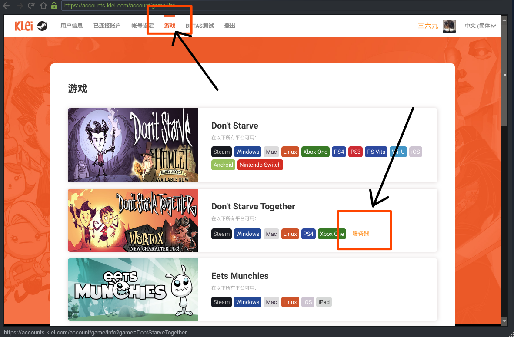

## 概括流程

- 安装软件运行环境；
- 安装 Steam 客户端；
- 在客户端中安装饥荒服务端；
- 配置饥荒服务端属性；
- 启动游戏。

------

## 一、解决环境依赖

- **安装必要的库文件**

Ubuntu 系统需要的依赖：

```sh
sudo apt-get install libstdc++6:i386 libgcc1:i386 libcurl4-gnutls-dev:i386 lib32gcc1
```

CentOS 系统需要的依赖：

```sh
yum -y install glibc.i686 libstdc++.i686 libcurl4-gnutls-dev.i686 libcurl.i686
```

## 二、安装 SteamCMD

- **新建目录 steamcmd**

此目录用于 steam 程序的安装目录。

```sh
mkdir ~/steamcmd
```

- **下载 SteamCMD 安装文件**

```sh
wget -P ~/steamcmd https://steamcdn-a.akamaihd.net/client/installer/steamcmd_linux.tar.gz
```

- **解压压缩包**

```sh
cd ~/steamcmd
```

```sh
tar -xvzf ~/steamcmd/steamcmd_linux.tar.gz
```

## 三、安装饥荒服务端 

- **启动 steamcmd**

```sh
./steamcmd.sh
```

请耐心等待客户端安装，直到进入了: `Steam>` 命令行模式。

如有遇到**安装进度**不走，请使用 `ctrl + c` 强制退出后重试。

- **使用公共账户登录 Steam**

```sh
login anonymous
```

- **指定游戏文件的安装目录**

```sh
force_install_dir ../dontstarvetogether_dedicated_server
```

- **安装饥荒服务端**

```sh
app_update 343050 validate
```

此过程所需时间视网络情况而定，请耐心等待下载。

安装完成后，使用以下命令退出 Steam 客户端。

```sh
quit
```

**（1）成功安装所出现的标志：**

`Success! App '343050' fully installed.`

**（2）如果在安装过程中出现了:**

`Error! App '232250' XXXXX...`

出现此类情况的原因是：Steam 存在网络连接问题。

解决方案则是先执行 `quit` 退出 Steam 程序，再重复步奏 *3.安装饥荒服务端* 的所述内容。

- **解决一个组件缺失**

```sh
cd ~/dontstarvetogether_dedicated_server/bin/lib32
```

```sh
ln -s /usr/lib/libcurl.so.4 libcurl-gnutls.so.4
```

## 四、配置饥荒服务端 （一）

===================================

【**本节内容为使用手写的方式获取配置文件**】

===================================

- **获取 cluster_token 和 UserID**

1.UserID

打开饥荒联机版的客户端，进入游戏，点击位于右下角的 **账号** 按钮，进入浏览器，记录用户 ID 值。

2.cluster_token

在上一步的网页中，点击导航栏的 **游戏** ，再点击 DST 的 **服务器**，进入页面后添加新服务器并记录内容。



- **新建饥荒配置文件目录**

饥荒的配置目录位于: `~/.klei/DoNotStarveTogether`

该目录下存放的是游戏存档，我们手动创建一个存档目录：

```sh
mkdir -p ~/.klei/DoNotStarveTogether/MyDediServer
```

```sh
cd ~/.klei/DoNotStarveTogether/MyDediServer
```

- **配置主配置文件**

新建 cluster.ini 文件，该文件定义了服务端的主要属性：

```sh
touch cluster.ini
```

在该文件中主要属性解释如下：

|字段|释义|
|-|-|
|max_players|最大在线人数|
|game_mode|游戏模式，可选：survival，endless，wilderness|
|pause_when_empty|服务器内无玩家时暂停|
|vote_kick_enabled|玩家投票踢人|
|max_snapshots|最大存档回滚次数|

```ini
[GAMEPLAY]
max_players = 6
pvp = false
game_mode = endless
pause_when_empty = true
vote_kick_enabled = true

[NETWORK]
cluster_description = 服务器描述
cluster_name = 服务器名称
cluster_password = 服务器密码
cluster_intention = cooperative

[MISC]
max_snapshots = 6
console_enabled = true

[SHARD]
shard_enabled = true
bind_ip = 127.0.0.1
master_ip = 127.0.0.1
master_port = 10889
cluster_key = supersecretkey
```

- **配置令牌和服务器管理员**

配置令牌：

**先新建** cluster_token.txt 文件，**再**将此前获取到的 Token 复制到文件中。

```sh
touch cluster_token.txt
```

**先新建** adminlist.txt 文件，**再**将此前获取到的 UserID 复制到文件中。

```sh
touch adminlist.txt
```

- **配置地上部分**

请在 MyDediServer 目下新建 Master 目录：

```ssh
mkdir Master
```

```sh
cd Master
```

配置独立配置文件，新建 server.ini 文件。

```sh
touch server.ini
```

文件内容如下：

```ini
[NETWORK]
server_port = 11000

[SHARD]
is_master = true

[STEAM]
master_server_port = 27018
authentication_port = 8768

[ACCOUNT]
encode_user_path = true
```

配置地图文件，新建 worldgenoverride.lua 文件。

```sh
touch worldgenoverride.lua
```

文件内容如下：

```lua
return {
    override_enabled = true,
    preset = "SURVIVAL_TOGETHER",
}
```

- **配置地下部分**

地下部分与地上部分极其相似，但是两个实例互相独立。

请在 MyDediServer 目下新建 Caves 目录：

```ssh
mkdir Caves
```

```sh
cd Caves
```

配置独立配置文件，新建 server.ini 文件。

```sh
touch server.ini
```

文件内容如下：

```ini
[NETWORK]
server_port = 11001

[SHARD]
is_master = false
name = Caves

[STEAM]
master_server_port = 27019
authentication_port = 8769

[ACCOUNT]
encode_user_path = true
```

配置地图文件，新建 worldgenoverride.lua 文件。

```sh
touch worldgenoverride.lua
```

文件内容如下：

```lua
return {
    override_enabled = true,
    preset = "DST_CAVE",
}
```

## 五、配置饥荒服务端 （二）

===================================

【**本节内容为通过客户端获取配置文件**】

比较推荐，客户端提供了一个图像化界面配置世界属性。

PS：有关 **MOD** 的配置和 **双服务器** 地上地下分离搭建部分也将在此部分提及。

===================================

- **利用客户端创建世界**

进入游戏，选择 **创建游戏** ， **联机版** ，风格随意，在进一步的界面中填写相应内容（名称、描述、密码等）；

切换选项卡至 **森林** ，在此界面可以修改相关世界属性，同理 **洞穴** 选项卡配置的是地下部分的世界属性（先选择增加洞穴）；

切换到 **模组** 选项卡，勾选需要在服务端启动的模组（记得同时配置模组）。

大体的配置内容完成后，选择 **形成世界** 进入游戏，等到人物选择界面后即可退出客户端。

- **提取配置文件**

以 Windows 为例（Linux/Mac 类似），存档位置位于 `/Users/username/Documents/Klei/DoNotStarveTogether` ，也就是文档目录下。

在该目录的下一级目录中 有一个命名为 `Cluster_X` 的文件夹（X 为数字编号），提取出刚刚创建的存档。

- **配置文件补充**

当然这个配置文件并不完整，需要做相应的补充。缺白名单、管理员等配置文件，**参考上文内容补全即可**。

- **分离地上地下**

正在看本片文章的你，想必是打算使用学生主机来搭建饥荒服务端吧。然而很遗憾的是无论是腾讯云还是阿里云，所提供的学生云主机都无法承担同时运行地上、地下两个部分。而折中的方法自然也就是将地上地下分开搭建。

- 先修改 cluster.ini 文件的 `bind_ip` 和 `master_ip` 内容

```sh
[SHARD]
shard_enabled = true
bind_ip = 0.0.0.0
master_ip = 你的主服务器的 IP （地上）
```

然后将文件夹命名为地上，再复制此文件夹，命名为地下。

最后地上删除 Caves 目录，地下删除  Master 目录。

- **Mod 模组配置**

Mod 的配置文件已经在提取到的文件夹中了，但是位于服务器的饥荒客户端还没有下载这些文件。

进入到服务器的的饥荒安装目录：

```sh
cd ~/dontstarvetogether_dedicated_server/mods
```

修改该目录下的 dedicated_server_mods_setup.lua  文件：

```sh
vim dedicated_server_mods_setup.lua

# 在该文件中添加类似这样的内容，这串 ID 是 Mod 文件在 Steam 中的 ID
# 可以在提取到的配置文件的 Master/modoverrides.lua 中找到
# 然后添加到本文件中，一行一个
ServerModSetup("362175979")
```

**文章末尾补充个人使用的 MOD 列表。**

- **上传配置文件到服务器**

使用 Ftp 的软件上传配置文件到服务器，相关位置可以参考上节内容。

## 六、启动游戏

- **启动脚本**

在家目录下新建脚本文件：

```sh
cd ~ && touch startDST.sh
```

脚本内容如下：

```sh
#!/bin/bash

steamcmd_dir="$HOME/steamcmd"
install_dir="$HOME/dontstarvetogether_dedicated_server"
cluster_name="MyDediServer"
dontstarve_dir="$HOME/.klei/DoNotStarveTogether"

function fail()
{
        echo Error: "$@" >&2
        exit 1
}

function check_for_file()
{
    if [ ! -e "$1" ]; then
            fail "Missing file: $1"
    fi
}

cd "$steamcmd_dir" || fail "Missing $steamcmd_dir directory!"

check_for_file "steamcmd.sh"
check_for_file "$dontstarve_dir/$cluster_name/cluster.ini"
check_for_file "$dontstarve_dir/$cluster_name/cluster_token.txt"
check_for_file "$dontstarve_dir/$cluster_name/Master/server.ini"
check_for_file "$dontstarve_dir/$cluster_name/Caves/server.ini"


check_for_file "$install_dir/bin"

cd "$install_dir/bin" || fail

run_shared=(./dontstarve_dedicated_server_nullrenderer)
run_shared+=(-console)
run_shared+=(-cluster "$cluster_name")
run_shared+=(-monitor_parent_process $$)

"${run_shared[@]}" -shard Caves  | sed 's/^/Caves:  /' &
"${run_shared[@]}" -shard Master | sed 's/^/Master: /'

```

给启动脚本添加权限：

```sh
chmod u+x ./startDST.sh
```

- **启动游戏**

到此所有的**配置过程结束**，但是为了方便饥荒在后台运行。

这里我们需要利用 `screen` 命令。

利用 screen 命令创建一个新窗口，便于后台运行：

```sh
screen -S DST
```

那么，现在请启动脚本，开始游戏吧

```sh
./startDST.sh
```

- **退出 screen**

`Ctrl` + `A` + `D`


## 七、附录

- **验证服务器**

在线验证服务器运行的网站：[Don't Starve Together Server](https://dstserverlist.appspot.com/)

* **个人用 MOD**

```lua
ServerModSetup("362175979")  -- Wormhole Marks        标记相联通的虫洞
ServerModSetup("378160973")  -- Global Positions      小地图显示玩家位置 共享地图发现
ServerModSetup("382177939")  -- DST Storm Cellar      风暴酒窖 80个插槽
ServerModSetup("385006082")  -- DST Path Lights       路径灯在黄昏时开启，在黎明时关闭
ServerModSetup("396822875")  -- Spike Trap            增加两个陷阱
ServerModSetup("444235588")  -- Deluxe Campfires      豪华营火 增加燃烧时间
ServerModSetup("458587300")  -- Fast Travel           快速旅行
ServerModSetup("458940297")  -- FFood Values          显示食物价值
ServerModSetup("462372013")  -- Always fresh          冰箱里物品永远不坏
ServerModSetup("462434129")  -- Restart               #重生 #复活 #自杀 Y:公聊 U:私聊
ServerModSetup("604761020")  -- Multi Rocks           持久挖矿 让卵石更耐挖
ServerModSetup("623286817")  -- Free transplant       移植无需施肥
ServerModSetup("661253977")  -- Don't Drop Everything 死亡不掉落
ServerModSetup("663554209")  -- Magic Freezer         更大个的冰箱 无损
ServerModSetup("666155465")  -- Show Me               鼠标显示更多信息
ServerModSetup("659459255")  -- Mandrake Tree         生成萤火虫
ServerModSetup("714712361")  -- Starting NovicePacks  小橘子的新手礼包
ServerModSetup("714719224")  -- Starting NovicePacks  小橘子的在线礼包
ServerModSetup("785295023")  -- Super Wall DST        超级墙DST 无敌的超级墙、自动门、栅栏和栅栏门
ServerModSetup("786556008")  -- 45 Inventory Slots    45个格子
ServerModSetup("831523966")  -- 999 Stack Size        叠加物品到 999 个
ServerModSetup("1301033176") -- Chinese Language      中文语言包 汉化了人物台词
ServerModSetup("1356189099") -- [DST]旅行青蛙         旅行青蛙
ServerModSetup("1463539363") -- Automatic Gardener   自动园丁

ServerModSetup("1510231311") -- 人物 Ringo
ServerModSetup("1548459642") -- 人物 Hachi
ServerModSetup("1592689346") -- 人物 花花

ServerModSetup("1418746242") -- 汉化增强 Chinese++ (含中文高清字体)
ServerModSetup("572538624")  -- Chinese Plus 中文汉化增强
ServerModSetup("367546858")  -- Chinese Language Pack 中文语言包
```

- **原文地址**

[Ubuntu Server 搭建饥荒服务端](https://inkss.cn/2018/06/04/ubuntu-builds-dst/)

- **实验室地址**

[腾讯云 - 开发者实验室](https://cloud.tencent.com/developer/labs/lab/10382)
