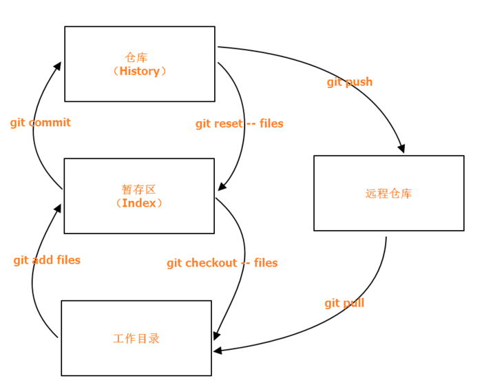
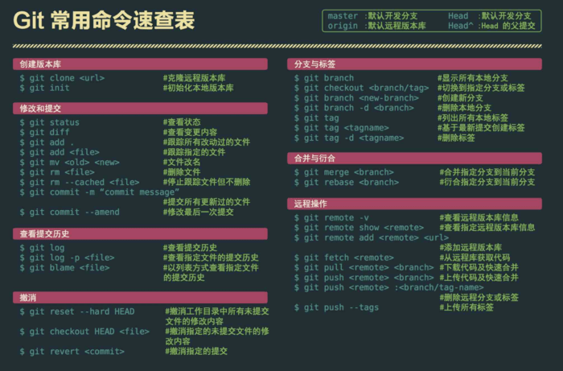

> 主要用于快速的介绍一下必要的 git 相关知识，事实上大都采用客户端进行 Git 的命令操作，纯使用命令行在终端下的场景并不是很多，本文以快速上手为主，使用 Typora 编写。

## 1 Windows 下 Git 配置

下载地址：`https://git-scm.com/` ，默认无脑下一步安装即可。

关于环境变量：在我看来配置环境变量的必要性不是很大，可以使用默认的 shell 进行相关控制。

## 2 Git 基础概念

## 3 Git 命令

------

[回到顶部](#top) © Inkss
