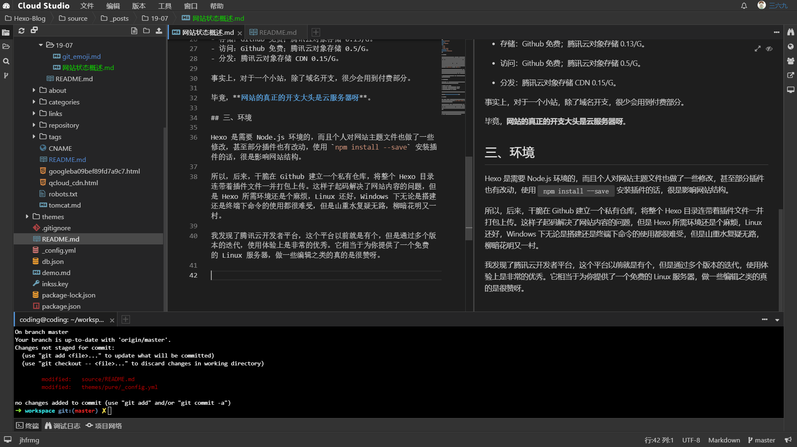

## 一、起始

万物皆有起源，本站的起始则是从 2018年11月 开始。谈及最初建个人网站的经历，大概在大一下的时候就开始了，不过当时选择的并不是 Hexo ，而是使用了很著名的一个博客系统：WordPress 。它简直是新手入门的不二之选呀，从购买服务器，到搭建服务器运行环境，再到购买域名，各类网站解析什么的，一种套流程下来，虽然各种懵逼，但是重在折腾呀。再后来，对 WordPress 的乐趣转向它的插件、主题上，各种主题、插件的尝试更换等等，现在想来有些本末倒置了。最后，因为没有对服务器/域名进行续费，第一个网站就荒废了。留念一下：*域名* ：`sunziy.cn` ，*站名* ：`不停` 。

后来的很长一段时间内，没有再接触过网站了，期间有对 Hexo 了解过一阵子，但也只是仅限了解，没有细致的尝试。就这样一直到了大三下，在制作简历的时候，认为网站会是一个加分项，边着手重新搭建一个。因为追求轻量化，那么作为静态博客的 Hexo 便是首选了。

> 维基百科中有言，古埃及人早在 3600 年前，便有驯养猫的历史，故曰猫之三千六百岁。

## 二、轻量简约

静态博客无需 WEB 服务器做处理，这样整个网站的开支降到一个极为节俭的程度。简单的罗列下本网站的开支吧：

- 域名：cn 域名 35/年。
- 存储：Github 免费；腾讯云对象存储 0.13/G。
- 访问：Github 免费；腾讯云对象存储 0.5/G。
- 分发：腾讯云对象存储 CDN 0.15/G。

事实上，对于一个小站，除了域名开支，很少会用到付费部分。

毕竟，**网站的真正的开支大头是云服务器呀**。

## 三、环境

Hexo 是需要 Node.js 环境的，而且个人对网站主题文件也做了一些修改，甚至部分插件也有改动，使用 `npm install --save` 安装插件的话，很是影响网站结构。

所以，后来，干脆在 Github 建立一个私有仓库，将整个 Hexo 目录连带着插件文件一并打包上传。这样子起码解决了网站内容的问题，但是 Hexo 所需环境还是个麻烦，Linux 还好，Windows 下无论是搭建还是终端下命令的使用都很难受，但是山重水复疑无路，柳暗花明又一村。

我发现了腾讯云开发者平台，这个平台在很早之前就存档，当时远远没有现在的易用性，多个版本的迭代后，Cloud Studio 使用体验上是非常的优秀，如你所见，整个编辑界面，应该是改自 Visual Studio Code 。最后提及一句，它相当于为你提供了一个免费的 Linux 服务器，做一些编辑之类的真的是很赞呀，可以让你随时随地修并提交网站内容。

## 占位，待补呢

说点什么呢，ed...
