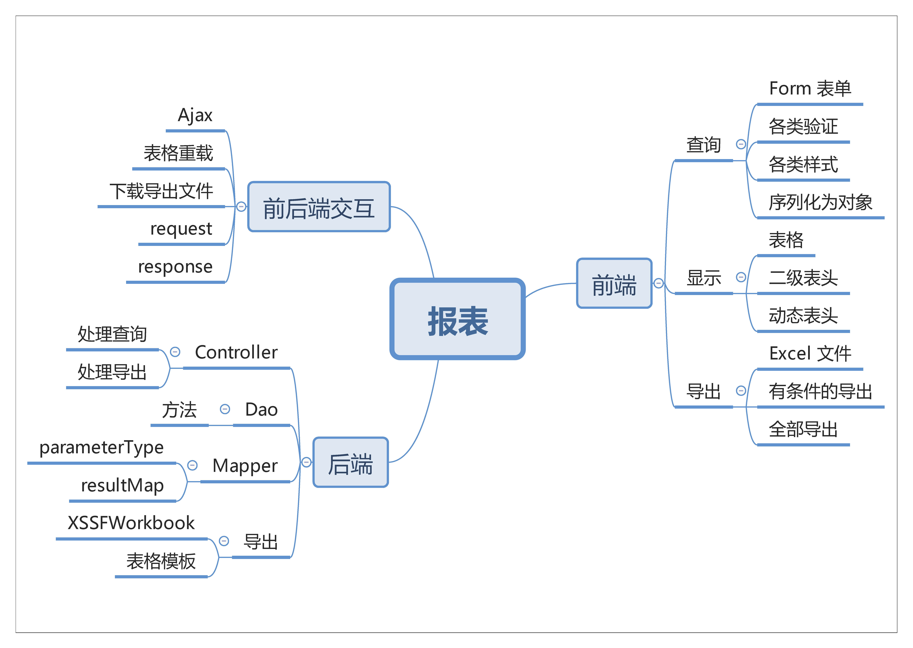

## 一、报表导出

> 通过设计 Excel 模板，对一组报表数据进行导出，抽象出各类公共方法，快捷调用。

### 1.1 概述

即使是粘贴、复制，也要按照最优雅的方式进行。

*那么我们先头脑风暴一下，分析导出报表需要做什么？*

#### 1.1.1 前端

用来显示的界面，我们需要一个展示查询数据的表格，一个用来输入查询条件的表单，一个用来导出查询内容的 Excel 。

进一步的，查询时有着 **各类验证** 、查询的表单内容有着 **各类样式** （如输入框、下拉框等）。除此之外，为了方便制作成模板，方便在前后端传值，表单的各列 `id` 和 `name` 最好是有规律的。为了在后期在 JS 中处理数据，方便调用，将表单值 **序列化为对象**。

然后是列表显示，可能的便是二级表单或者动态表头，除此之外的功能借用 Layui 的数据表格显示；最后是导出，有查询条件存在和无查询条件存在时 **导出内容的差异** 等。

总结一下前端，根据功能按照三个方向进行： **表单**、**表格**、**导出** 。

#### 1.1.2 后端

后端从功能上概括则是接收前端传过来的查询数据，然后进行查询并返回结果给前端。按照经典的模型来分析：`Controller` `Dao` `Mapper` ，因为逻辑清晰，我们不需要中间多业务层。进一步分析，模板化方法的同时，我们还需要两个 `pojo` 对象，一个用来接收查询条件，一个用来接收查询结果（`parameterType` 和 `resultMap`）。

接着是导出功能，根据逻辑，有查询条件时导出所有经过查询条件筛选后的结果，没有查询条件时导出所有结果，导出时不同表格有不同的样式、表头、标题，这里做成模板文件，在导出时根据模板文件填充数据。

总结一下后端：**查询**、**导出**。

#### 1.1.3 前后端交互

同样，接着是前后端交互部分，以 Ajax 为基本，POST 或 Get 等方式完成查询、导出的流程。

### 1.2 流程

基于以上的分析，我们制作出如下所示的思维导图：

## 二、下期预告

在完成主体的内容分析之后，下期我们将从前端开始，根据要求一个个搭建我们所需要的功能。
