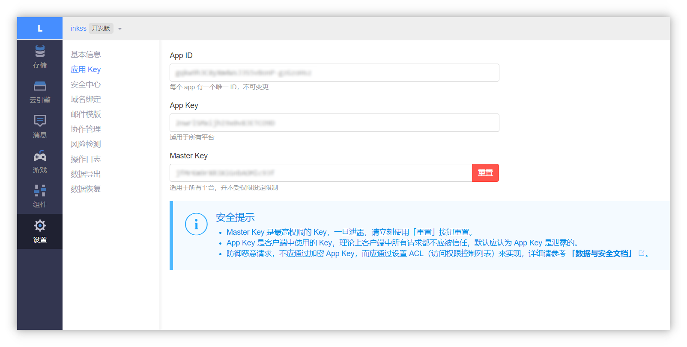

### 一、Hexo 博客

#### 1️. 评论系统

Hexo 作为一个静态博客，其本身是不具备动态评论能力的，一般是通过引用第三方插件，根据识别到的文章链接进行评论控制，这里可选的有：**畅言**、**来必力**、**Disqus**、**Hypercomments**、**Gitment**、**Gitalk**、**Valine** 等。大致的区别如下：

- 畅言和来必力属于比较大的商业评论系统；

- Disqus 和 Hypercomments 在国外用的比较多，国内一般无法使用；

- Gitment 和 Gitalk 是基于 Github issue 的评论插件，需要拥有 Github 账户方可评论；

- Valine 是基于 Leancloud 的评论系统。

#### 2. 个人选择

对我本人来说，畅言和来必力不是很喜欢，Disqus 和 Hypercomments 国内无法访问也不用太多考虑，除非是为了做到筛选用户还差不多，所以也就剩下的三个了。但是依托于 Github 存在的评论插件需要 Github 账户，而且会占用一堆 issue ，不过这都是小问题，**最主要的是安全问题**，在 Github 登录时，请求的权限如下：

> This application will be able to **read and write all public repository data** . This includes the following:
> `Code` `Issues` `Pull requests` `Wikis` `Settings` `Webhooks and services` `Deploy keys`

如你所见，这个权限申请的太大了，个人方便不是很喜欢，不是非常的相信陌生人。所以最佳选择就是 Valine 了，早些年 Valine 有一个优势是无需备案，不过在 Leancloud 调整策略后，是需要备案+实名制了（**国际版无需备案实名**）。对我来说，网站备案也没什么，主要是讨厌手持身份证拍照，好在 Leancloud 接入了支付宝的实名认证，倒也是好解决。

### 二、评论配置

------

#### 1. Hexo 主题

到此，就不得不涉及到主题部分了，事实上因为评论是一个公有的需求，大部分主题都内置了一个或多个评论系统，我们只需要在配置文件中手动选择即可。例如本站所使用的主题，内置了： `第三方评论框（友言、来必力、gitment、gitalk、Valine）`

在主题的配置文件中，可以对 Valine 的各种属性进行定制（更多内容可在其 [官网](https://valine.js.org/configuration.html) 查看，这里不多赘述）：

```yml
  valine:                                   # Valine. https://valine.js.org
    appid:                                  # your leancloud application appid
    appkey:                                 # your leancloud application appkey
    notify: false                           # mail notifier
    verify: false                           # Verification code
    placeholder:  just go go                # Comment box placeholders
    avatar: retro                           # gravatar style
    meta: nick,mail,link                    # custom comment header
    pageSize: 10                            # pagination size
```

当然以上只是评论配置部分，这部分主题可以帮助你完成，最主要的后端配置是在 [Leancloud](https://leancloud.cn) 上进行，下文介绍了获取 `appid` 和 `appkey` 的方法，将这两串数值填写至配置文件中。至此，你的评论系统就出现啦，enjoy it~

#### 2. 获取 ID 和 Key

请先 [登录](https://leancloud.cn/dashboard/login.html#/signin) 或 [注册](https://leancloud.cn/dashboard/login.html#/signup)  `LeanCloud` , 进入 [控制台](https://leancloud.cn/dashboard/applist.html#/apps) 后点击左下角 [创建应用](https://leancloud.cn/dashboard/applist.html#/newapp)：

应用创建好以后，进入刚刚创建的应用，选择左下角的 `设置` > `应用Key` ，然后就能看到你的 `APP ID` 和 `APP Key` 了：



------

### 三、评论通知

刚配好的新鲜出炉的 Valine 是没有邮件通知和评论管理能力的，这里我们进一步配置，此处只需要在上一步中创建的 Leancloud 应用里操作即可，主要操作对象为云引擎和域名绑定，域名主要用于执行定时唤醒任务和评论管理。

#### 1. 快速部署

- 进入 Leancloud 应用的 **设置-域名绑定** 界面，完成云引擎域名的域名绑定（建议使用二级域名）。

- 进入 **云引擎-设置** 界面，填写 **代码库** 并保存：👉  `https://github.com/DesertsP/Valine-Admin.git`

- 在 **云引擎-设置** 页面，填写指定的 **环境变量** ，再次强调，请务必配置完成二级域名解析。

变量 | 示例 | 说明
--- | ------ | ------
SITE_NAME | `猫之三千岁` | [必填] 博客名称
SITE_URL  | `https://inkss.com` | [必填] 首页地址 
SMTP_SERVICE | `163` | [必填] 邮件服务提供商，详见：[Supported services](https://nodemailer.com/smtp/well-known/#supported-services) 
SMTP_USER | `szyink@163.com` | [必填] SMTP 登录用户
SMTP_PASS | `xxxxxx` | [必填] SMTP登录密码
SENDER_NAME | `猫猫说-评论通知` | [必填] 发件人 
SENDER_EMAIL | `szyink@163.com` | [必填] 发件邮箱
ADMIN_URL | `https://xxx.inkss.cn` | [必填] Web 主机 **二级域名**
BLOGGER_EMAIL | `szy@szyink.com` | [可选] 博主通知收件地址
AKISMET_KEY | `xxxxxxxxxxxx` | [可选] 垃圾评论检测

- 在 **云引擎-部署** 页面，分支使用 master，点击部署即可,第一次部署需要花点时间。

- 评论管理：访问设置的二级域名`https://二级域名.xxxxx.cn/sign-up`，注册管理员登录信息，之后登录后即可管理评论。

>注：使用原版 Valine 如果遇到注册页面不显示直接跳转至登录页的情况，请手动删除 _User 表中的全部数据。

#### 2. 定时任务

> 我们为所有应用提供免费的 **体验实例**，体验实例有 [**每天 6 小时的强制休眠时间**](https://leancloud.cn/docs/leanengine_plan.html#hash633315134) ，升级为标准实例即可免除限制。[点击查看详情](https://leancloud.cn/docs/leanengine_plan.html)

如你所见，免费应用有六小时强制休眠时间，我们需要定时任务控制这六个小时为 0-6 点做到最大程度的在线能力。

**新建定时任务：**

- 自动唤醒：函数 `self_wake` ，Cron 表达式 `0 */20 7-23 * * ?`
- 邮件补发：函数 `resend_mails` ，Cron 表达式 `30 0 8 * * ?`

以上内容的含义为：每天 7 点到 23:40 分，每隔 20 分钟执行一次自动唤醒任务；每天 8:0:30 执行邮件补发任务。

------
