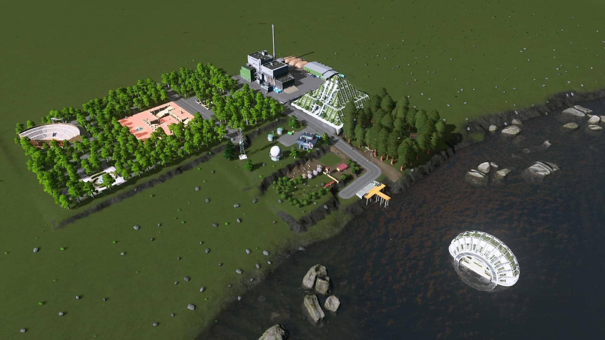
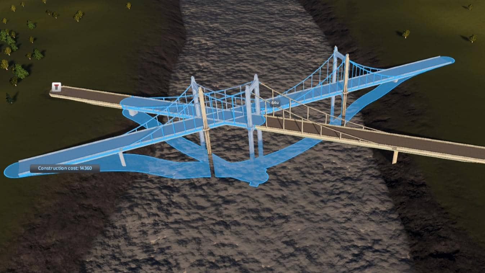
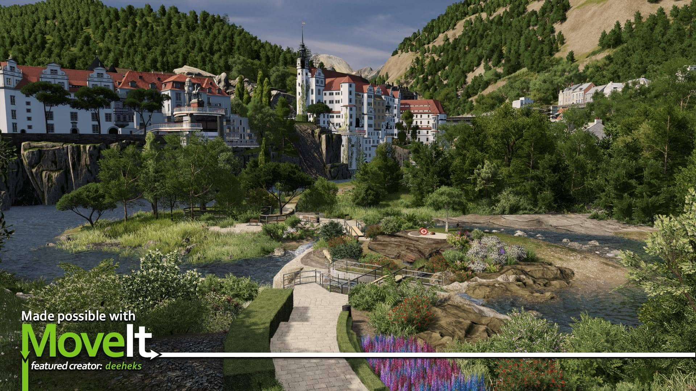

## 一、前言

&ensp;&emsp;城市天际线（Cities: Skylines）是我最喜欢的一款游戏，也有可能是我唯一一个连续不断购买 DLC 的游戏了，哈哈，万恶的 P 社。有那么一个说法，“枪毙P社玩家，没有一个是冤枉的？”，此外还有另外一句后续，千万别漏掉天际线玩家。

&ensp;&emsp;当然天际线玩家比不上 P 社四萌里的战争洗地，也比不过群星里动辄就是一发歼星炮，天际线玩家还好只是安安稳稳的当着一市之长而已，当然早些年哔哩哔哩上，有着层次不穷的 粪水XX 还是比较恶劣的，不过现在也有走高端向 [WilliamC超蜀黍](https://space.bilibili.com/156322562) 的《城市天际线》天际线造景极致1:1城市第一季第1集》的出现。

&ensp;&emsp;言归正传，最近天际线也更新了一个主要的 DLC ：《Cities: Skylines - Sunset Harbor》，所以忽然发现路陆陆续续的也出了不少了，很想来一次原版体验，所以移除了大部分 MOD ，只保留了一下个人认为相较基础的订阅，不过特此记录了一些基础性的打底 MOD。

## 二、基础性 MOD

> 天际线基础 MOD 安利，大都不涉及资产，大都为对游戏基础性功能修改，我将其视为打底 MOD。
>
> 在创意工坊里搜索这些 MOD 的名称订阅便能使用了。

### 1. Remove Need For Power Lines



<!-- tab 简介 -->
移除游戏对电力线的需求，不需要拉各种电线啦。
<!-- endtab -->

<!-- tab 截图 -->

<!-- endtab -->



### 2. Remove Need For Pipes



<!-- tab 简介 -->
移除管道（水管、热水管）的需求，PS：供水口、排水口还是需要连接的。
<!-- endtab -->

<!-- tab 截图 -->

<!-- endtab -->



### 3. Mod Achievement Enabler



<!-- tab 简介 -->
在开启 MOD 订阅的同时，可以继续获得成就，聊胜于无啦。
<!-- endtab -->



### 4. No Border Limit Camera



<!-- tab 简介 -->
可以不受限制的移动视角，可以预览整个地图了。
<!-- endtab -->



### 5. Tree Brush



<!-- tab 简介 -->
树刷，可以在地图上批量刷出各类树木，一般是用来建工厂时用的，算是造景用 MOD 之一。
<!-- endtab -->

<!-- tab 截图 -->

<!-- endtab -->



### 6. All 25 Areas purchasable



<!-- tab 简介 -->
解锁地图中所有的 25 个格子，其实还有地图全解锁的，但是考虑到电脑性能和规模，25 格够用啦。
<!-- endtab -->



### 7. Unlock All + Wonders & Landmarks



<!-- tab 简介 -->
顾名思义，解锁所有奇观、独特建筑、进程里程碑，做任务什么的还是挺麻烦的。
<!-- endtab -->

<!-- tab 截图 -->

<!-- endtab -->



### 8. TM:PE V11 STABLE



<!-- tab 简介 -->
一个非常强大的 MOD ，可以对天际线里的交通状况做出很大的改善。
<!-- endtab -->

<!-- tab 截图 -->

<!-- endtab -->



### 9. Find It!



<!-- tab 简介 -->
一款造景必备的 MOD ，可以在地图上摆放各种小组件。
<!-- endtab -->

<!-- tab 截图 -->

<!-- endtab -->



### 10. Prop Line Tool



<!-- tab 简介 -->
造景用 MOD 之二，可以像规划道理一样规划摆件。
<!-- endtab -->



### 11. Fine Road Anarchy 2.0.2



<!-- tab 简介 -->
可以不受限制的摆放道路，解除各种碰撞规则，做出一些稀奇古怪的路线模型。
<!-- endtab -->

<!-- tab 截图 -->

<!-- endtab -->



### 12. Demand Master



<!-- tab 简介 -->
需求控制，就是可以自定义人口、商业、工业需求，锁死什么的。
<!-- endtab -->

<!-- tab 截图 -->

<!-- endtab -->



### 13. Loading Screen Mod



<!-- tab 简介 -->
在我看来最大的用处是可以导出加载 MOD 时的报告，查清冲突、缺失等。
<!-- endtab -->

<!-- tab 截图 -->

<!-- endtab -->



### 14. Move It



<!-- tab 简介 -->
造景用 MOD 之一，可以对城市外观做出更精致的修改，需要两个前置依赖。
<!-- endtab -->

<!-- tab 截图 -->

<!-- endtab -->



### 15. Precision Engineering



<!-- tab 简介 -->
在建造道路时，拥有更精准的角度提示。
<!-- endtab -->

<!-- tab 截图 -->

<!-- endtab -->



### 16. Clouds & Fog Toggler



<!-- tab 简介 -->
移除缩小时的云雾，此外还可以移除工业烟雾。
<!-- endtab -->

<!-- tab 截图 -->

<!-- endtab -->



### 17. AutoLineColor Redux



<!-- tab 简介 -->
在创建公共交通路线时自动分配不同的颜色，其实我是有点疑惑的，因为 switch 上的天际线明明有这个功能，为什么 PC 版的反而没有了呢？
<!-- endtab -->



### 18. Customize It!



<!-- tab 简介 -->
可以修改各种建筑的需求，必须电力啊，噪音啊，污染啊，支出啊什么的。
<!-- endtab -->

<!-- tab 截图 -->

<!-- endtab -->



### 19. Prefab Hook



<!-- tab 简介 -->
大部分 MOD 的前置依赖。
<!-- endtab -->



## 三、建筑类 MOD

未完待续..
