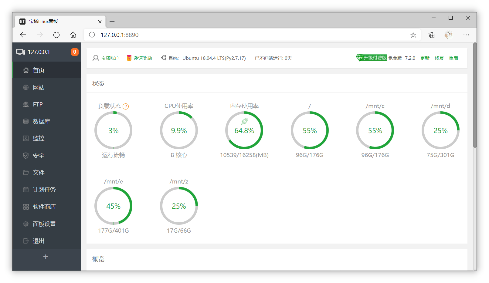

&emsp;&ensp;在很早之前，我就有一个需求，需要一个小型灵活的本地服务器，因为目的在于轻便、快捷，所以倘若搭建 Nginx 到本机又有些浪费性能，过于臃肿，毕竟不是服务器。而小型服务器的话如 Tomcat 启动起来还是有些麻烦。我查过使用 PhpStudy 的这类软件，感觉用起来又不是那么顺心如意。此之前，一直使用的是 VS Code 里的插件：`Live Server` 完成轻量网页的启动，也算是集编辑、运行、查看于一身了。

&ensp;&emsp;这是前话，然后下面讲讲 WSL，VS Code 可以通过 Rmote - WSL 链接到本地的 Linux 子系统，我也是一直这样做的，偶尔一些环境搭建起来麻烦的使用子系统做的，我是用的子系统 Ubuntu 18.04 ，倒也是我最熟悉的一个系统了。言归正传，本身我有一台阿里云的 CentOS 服务器，在上面搭建了宝塔面板，于是便突发奇想，能否在本机装上面板呢？这样对与网站需求来说就有了更多的用途。

## 一、面板部署

&ensp;&emsp;这部分没有什么好说的，普通的命令行安装，利用 Root 账户执行安装即可，可能会费一些时间，但是成绩斐然，顺利的部署上了（说到此，忽然想起最新的发行版，20.04 似乎还有一些软件上的不兼容，18.04 还是再等等不要升级的好）。

&ensp;&emsp;部署成功后，在终端的结果处收到地址、账户、密码，登录处理一些就行了。地址默认位 `127.0.0.1` ，是的没错即使是子系统，其实也是和本地主机的 IP 相同的，接下来就先改改端口、安全入口什么的即可。



&ensp;&emsp;配置信息一目了然，甚至原本的 Windows 下磁盘也被显示出来的，接下来也就是到软件商店里安装环境了，为了测试此处使用的环境与服务器端用的是一致的：Nginx 1.16.1，Mysql 5.7.29，PHP 7.2，当然还有 Pure-Ftpd 以作备用。


&ensp;&emsp;为什么要选择在子系统上安装，那就不得不说一个资源占用的问题了，以上环境倘若开启了自启又略显浪费，而不开启的话，在 Windows 下启动还要跑到服务里，找到相关服务才能开启，而个人认为最理想的莫过于即用即启，本身不需要长时间运行服务器，而最重要的就是面板的存在减少了大量配置文件的修改，更别说服务器这类环境天然适合 Linux 系统呀。

## 二、启动

&ensp;&emsp;是的，没错，Windows 在启动时不会处理任何 WSL 的程序，包括不启动宝塔面板。这里参考了 [Win10 子系统 ssh 服务自启动设置](https://blog.csdn.net/toopoo/article/details/85733566) 。宝塔本身有启动脚本，我们不用手写脚本了，然后大概流程就是在 Windwos 的启动文件里放一个 vbs 脚本，在开机时利用 `wscript.shell` 执行命令。

&ensp;&emsp;思路很简单，`wsl -d DistributionName -u UserName command`，子系统名称可以用 `wsl -l` 查看，综上：

```vbs
Set ws = CreateObject("Wscript.Shell")
ws.run "wsl -d Ubuntu -u root /etc/init.d/bt start", vbhide
```

&ensp;&emsp;如此，愉快的玩耍吧~