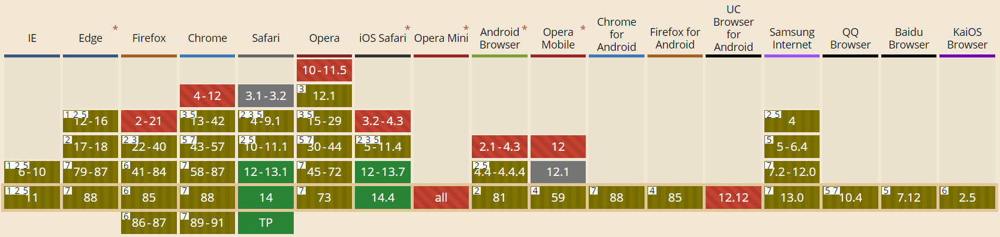

&ensp;&emsp;本文分为两部分：自定义右键和剪切板的事件处理。主要目标是在自定义网页右键的基础上，实现诸如复制、粘贴的剪切板操作，文本选中的复制、图片的复制和输入框下的粘贴。

## 一、自定义右键

&ensp;&emsp;前端页面的自定义右键通过 `oncontextmenu` 实现，相关兼容性如下：

&ensp;&emsp;基本不用担心兼容性问题，对全局右键的修改如下，需要注意的是得返回 `false` 用以阻止默认菜单。


window.oncontextmenu = function (event) {
  // do..
  return false;
}


### 1. 右键菜单的绘制

&ensp;&emsp;这里，在参数 `event` 我们可以拿到所需要的变量。

## 二、剪切板操作


