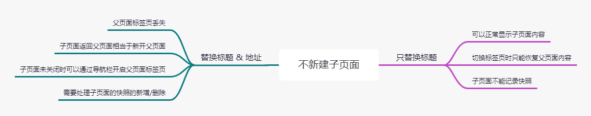

&ensp;&emsp;最近处理了一个标签页与父子页面联动的问题，在一个新项目中，前端框架是在另一个项目的基础上使用的，在原有项目中只有单纯的列表查询，通过不同导航页进入不同的标签页，然后查询并显示结果。而在新项目上，还需要处理另一种业务情况：从父页面进入子页面，例如查询页跳转到详情页/编辑页，此时才发现这个框架的坑，而偏偏还已经开发了一段时间，换框架是没得可能只能硬着头皮改造。

&ensp;&emsp;这里的主要问题是：标签页是与路由绑定的，在进入子页面时是否要打开新的标签页？子页面的返回行为又该如何处理。在各种妥协讨论后，最终选择方案就是：**子页面打开时新建标签页且相同组件只能创建一个，父页面关闭时连带着子页面一起关闭。**

## 一、业务背景

&ensp;&emsp;作为一个 Angular 后台管理项目，布局结构是传统的 **顶部-侧边布局-通栏** （见下图），同样拥有顶部导航及侧边栏，而由于是 SPA 单页应用的缘故，页面地址是记录在地址后的 `#` 后面。Tab 栏作为已打开页面的切换入口，与路由进行了关联。

### 1. 标签页与路由复用

&ensp;&emsp;当标签页与路由联动后，在处理父子页面上出现了一些问题，由于标签页是与地址 Url 直接匹配的，所以如果在父页面中进行诸如查看详情之类的操作时，子页就只有两种处理方式：一是顶替覆盖当前父页面所对应的标签页，另一则是独立新建一个标签页 *（当前框架设计没法使用子路由 🎈）*。

&ensp;&emsp;对于标签页来说，标签的切换本质上还是路由跳转，在切换过程中就涉及到路由复用的处理，通过实现 `RouteReuseStrategy` 完成自定义的复用策略。简单来说就是在 *路由离开时记录，路由切换时恢复，标签页删除时销毁* 。一般来说是用当前路由的地址作为 Key ，此后都通过这个 Key 进行操作，也就是：


/** 当路由离开时会触发。 */
public store(route: ActivatedRouteSnapshot, handle: DetachedRouteHandle): void {
  if (SimpleReuseStrategy.waitDelete && SimpleReuseStrategy.waitDelete === this.getRouteUrl(route)) {
    SimpleReuseStrategy.waitDelete = null;
    return;
  }
  SimpleReuseStrategy.handlers[this.getRouteUrl(route)] = handle;
}

// 根据路由包装地址
private getRouteUrl(route: ActivatedRouteSnapshot) {
  // 这句代码可以获取当前路由的组件名componentName，但生成环境（打包）将组建名缩写成随机单个字母，
  // 所以需要手动通过route.routeConfig.data['componentName']去获取在路由上自定义的组件名
  let componentShortName = (route.routeConfig.loadChildren
                                || route.routeConfig.component.toString().split('(')[0].split(' ')[1]);
  if (route.routeConfig.data && route.routeConfig.data['componentName']) {
    componentShortName = route.routeConfig.data['componentName'];
  }

  const url = route['_routerState'].url.replace(/\//g, '_');
  return url.substring(0, url.indexOf('?') === -1 ? url.length : url.indexOf('?')) + '_' + componentShortName;
}


&ensp;&emsp;由于标签页切换的本质就是路由跳转，**所以标签页记录的这个地址就相当重要了。**

### 2. 标签页的事件处理

&ensp;&emsp;对于标签组件，需要实现的核心功能便是：增删没有改。通过对 Router 的事件进行过滤我们可以拿到定义在 RouterModule 里的路由信息。


this.router.events.pipe(
  filter(event => event instanceof NavigationEnd),
  map(() => this.activatedRoute),
  map(route => {
    while (route.firstChild) {
      route = route.firstChild;
    }
    return route;
  }),
  filter(route => route.outlet === 'primary'),
  mergeMap(route => route.data)
  ).subscribe(
    const menu = {...event};    // 这里的 menu 就是我们需要的信息
  }
);



&ensp;&emsp;将所有的 `menu` 记录到 `this.menuList` 中，也就得到当前打开了多少标签页，以及他们的标题、地址信息等等。

## 二、父子页面处理

&ensp;&emsp;简单来说该问题可以视为 **是否新建子页面的标签页** ，进一步的则是是否保留父页面标签。我们已经知道路由离开时会按照地址存在快照中，所以需要同时处理恢复快照的逻辑，并且无论是快照、标签页、还是路由跳转都与地址息息相关，以地址为准。

### 1. 子页面不新建标签页

&ensp;&emsp;如果不新建标签页，那么就得修改原父页面中存储的字段（狸猫换太子？ 顶替掉父页面内容）。首先是需要替换的字段，标题用以显示在标签页中自然得替换，那么剩下的就是组件名和地址了：*标签页通过地址作唯一判断，快照通过地址和组件名作唯一判断*。所以替换地址就相当于丢失了父页面的信息，从子页面返回时约等于新建一个父页面。这个方案在**逻辑上父页面标签丢失**，所在此时在导航栏上点击父页面会新开一个标签页，这里父子页面就同时出现违背初衷了。

&ensp;&emsp;而如果就替换标题，逻辑上父页面标签还是它本身，只是名称替换了，恢复时所有信息都还在。但是，**由于当前标签页还是父页面地址，在进行标签页切换回到此标签时恢复的是父页面的内容**，而不是子页面，同时在快照缓存上，为了避免内存泄漏，所有的子页面都不能记录快照。原则上说只要用户不切换页面，这个方式还算是可行的，我最初也就是使用的这套，因为简单框架改动不大。*可是，可是客户爸爸它不认啊，* 还是需要切换标签页后还能回到子页面，然后才有了接下来的苦逼改框架过程。

### 2. 子页面新建标签页

&ensp;&emsp;在最初的设想中是不限制子页面打开的数量，可以通过父页面的跳转到不同内容下的相同子页面（组件），程序实现上也没什么问题，但是业务上存在个问题：有些子页面是拥有回到父页面的功能，例如子页面新增后提交等等。如果按照返回来说，返回自然是回到进入子页面前的父页面状态，但是因为子页面不限制，所以**可能出现子页面还未关闭，父页面修改了页面内容并打开了另一个子页面**，这两个子页面拥有不同的查询条件，而快照只能记录/返回最后一次的父页面信息，所以在业务上不限制子页面数量这是个问题，解释不通。

*未完待续*
