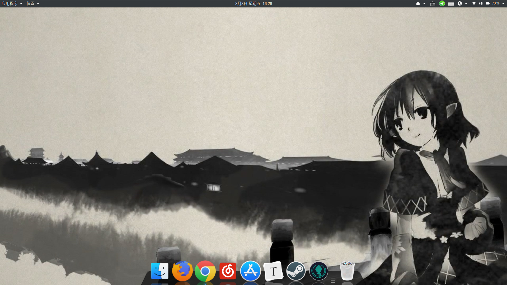
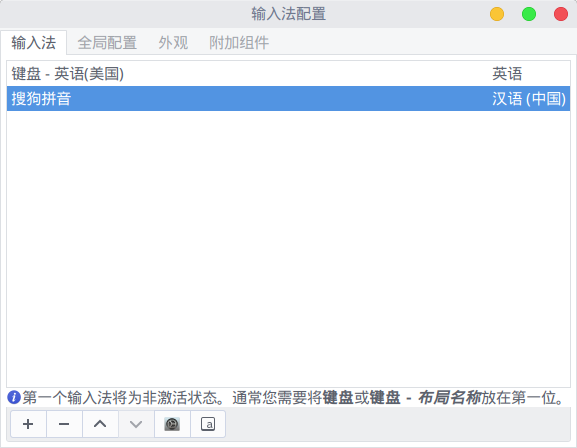
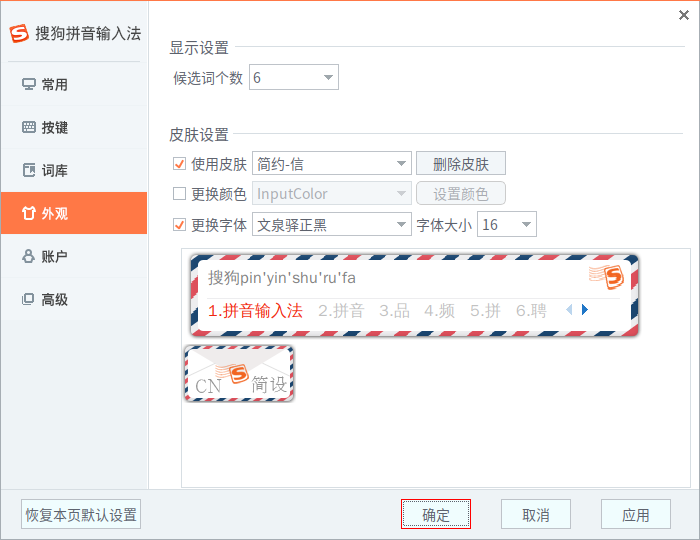
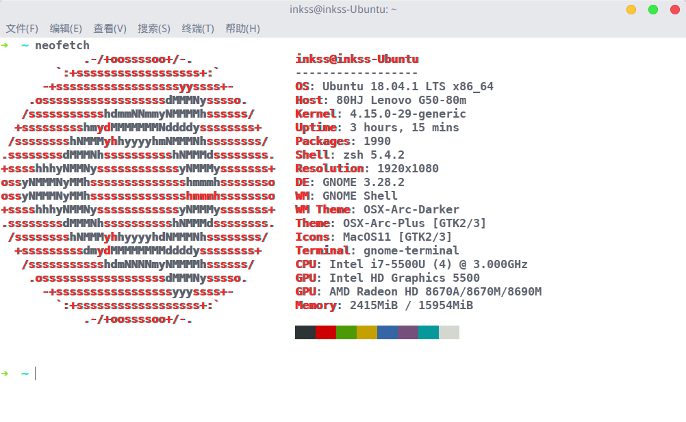

# Ubuntu 18.04 安装、配置和美化

- 概述：UEFI 引导下的 Win10 与 Ubuntu 双系统安装记录。
- 前置：在 Windows 系统上通过压缩卷给 Ubuntu 划分空间安装之。
- 简介：曾经记录过一篇安装 Ubuntu 18.04 的注意事项文章，但是所有过程都是在虚拟机下进行的，本次则使用双系统的方式对系统进行安装。内容上包括：系统的安装、配置、美化和一些软件的安装介绍。
- 地址：[本文章](https://github.com/inkss/markdown/blob/master/Linux/Ubuntu/Ubuntu-18.04-%E5%AE%89%E8%A3%85%E8%AE%B0%E5%BD%95.md)原文件存放在 GitHub 的 [markdown](https://github.com/inkss/markdown) 仓库中（推荐下载后使用 [Typora](https://typora.io/) 阅读）。

------

## 目录

* [一、安装操作系统](#一-安装操作系统)
  * [（1）引导盘](#1-引导盘)
  * [（2）分区](#2-分区)
  * [（3）安装系统](#3-安装系统)
* [二、初步系统配置](#二-初步系统配置)
  * [（1）不可或缺的更新](#1-不可或缺的更新)
  * [（2）双系统的时区问题](#2-双系统的时区问题)
  * [（3）更换终端类型](#3-更换终端类型)
* [三、配置与美化系统](#三-配置与美化系统)
  * [（1）Gnome-tweak-tool](#1-gnome-tweak-tool)
  * [（2）主题 图标 字体](#2-主题-图标-字体)
  * [（3）搜狗输入法](#3-搜狗输入法)
  * [（4）底栏 Docky](#4-底栏-docky)
* [四、软件安装与记录](#四-软件安装与记录)
  * [（1）Deepin-Wine 环境：QQ、百度网盘、微信等 ](#1-deepinwine-环境)
  * [（2）网易云音乐（解决无法打开软件的问题）](#2-网易云音乐)
  * [（3）一般性软件安装（谷歌、SS、Typora 等）](#3-一般性软件安装)

------

## 一 安装操作系统

### 1 引导盘

鉴于现在都 18 年了，是时候抛弃 Legacy 引导，完全采用 UEFI 引导了。

而这里有两种选择（所有操作均在 Windows 下进行）：

- 刻录到光盘：

  使用 *[UltraISO](https://www.ultraiso.com/download.html)* 进行刻录，在完成之后，电脑可以对光盘识别到 Legacy 和 UEFI 两种方式的引导项。而如果 BIOS 中设置为仅 UEFI ，就只需直接选择进行安装即可。

- 刻录到 U 盘：

  Ubuntu 官网中推荐的 U 盘刻录工具为 *[Universal-USB-Installer](https://www.pendrivelinux.com/universal-usb-installer-easy-as-1-2-3/)* ，但是需要注意的是这个工具刻录后的 U 盘只有 Legacy 引导 ，所以只能抛弃该软件。然后在网上简单的搜索后找到了另一款 U 盘刻录工具：*[Rufus](https://rufus.akeo.ie/?locale=zh_CN)*，提到了其具有**免安装、绿色版、支持 UEFI 引导**的特点，那么就选用它了。

> 刻录过程不多赘述，Rufus 刻录时分区类型选择 `GPT`。

### 2 分区

本次目标是做一个双系统出来，所以保留原 Windows 系统，压缩出一个分区给 Ubuntu 使用。

打开 Windows 的文件管理器（快捷键 Win + E），展开顶部选择**计算机**→**管理**。

然后选择**磁盘管理工具**，对相应分区进行压缩。

> 具体的压缩教程可搜索查询，需要注意一下对压缩后的新分区**不要新建简单卷或格式化**。

### 3 安装系统

正常的安装过程，诸如对 BIOS 进行设置之类，网上教程很多，这里不多赘述。

> 在到 *安装类型* 这一步时，如果你在上一步压缩完分区后，没有新建简单卷，那么就会多出一个**安装 Ubuntu，与 Windows boot manager 共存**这一选项，那么就只需默认无脑下一步即可。
>
> 而如果需要自主划分分区，就选择 *其他选项 。*分区只推荐划分出根 `/` 和家目录 `/home`。
>
> 注意1：为了系统的稳定，安装过程中请连上网络，勾选**安装 Ubuntu 时下载更新**。
>
> 注意2：安装时选择**最小安装**，除非你对雷鸟、LibreOffice  之类的软件感兴趣。

## 二 初步系统配置

### 1 不可或缺的更新

如果在上一步中勾选了安装 Ubuntu 时下载更新，那么大部分的更新已经下载完毕。

不过为了确保，先移步到**设置**→**详细信息**，点击右下角的**检查更新**，如果存在更新，那么完成相应的更新操作。

接着移步到**设置**→**区域和语言**→**管理已安装的语言**，在此处完成一个更新下载。

最后，为了确保全部内容都更新完毕，打开终端使用命令安装更新：

```sh
sudo apt update
sudo apt upgrade
```

也可以不使用命令行，使用 *软件更新器* 对系统和软件进行更新。

### 2 双系统的时区问题

双系统下 WIndows 与 Ubuntu 的时间将会不相同，原因不多阐述，解决方案如下：

```sh
timedatectl set-local-rtc 1
```

### 3 更换终端类型

这里推荐使用 **oh-my-zsh** ，因为其具有十分方便的 *Tab* 补全能力：

```sh
sudo apt-get install git
sudo apt-get install zsh
wget https://github.com/robbyrussell/oh-my-zsh/raw/master/tools/install.sh -O - | sh
chsh -s /usr/bin/zsh
```

> 重启系统以生效。

## 三 配置与美化系统



### 1 Gnome-tweak-tool

Ubuntu 18.04 与 16.04 最大的变动就是抛弃了 Unity 桌面，使用 Gnome ，所以先安装以下工具：

```sh
sudo apt install gnome-tweak-tool
sudo apt install gnome-shell-extensions
sudo apt install chrome-gnome-shell
```

此时，用快捷键 Super + A 打开应用列表，选择软件 *优化* ，该软件提供了大量对系统外观的更改选项，先到**扩展**中开启 **User thems** ，如此便能修改 *shell* （别的扩展根据需求开启）。

推荐一个下载主题的网站：[Gnome-look](https://www.gnome-look.org/) 


> 上图中主题和图标的的下载地址：[OSX-Arc](https://www.gnome-look.org/p/1167049/)、[MacOS Icon](https://www.gnome-look.org/p/1102582/)

### 2 主题 图标 字体

下载的主题如果是 deb 包的形式，安装方式见下文。而如果是压缩包的形式，那么就只能解压它放到对应的目录中了，这个目录有两种，区别上类似于 Windows 环境变量里的个人和系统。为了方便起见全放在系统里。

- 主题存放目录：`/usr/share/themes`
- 图标存放目录：`/usr/share/icons`
- 字体存放目录：`/usr/share/fonts`

以上三个目录需要 root 权限才能修改，秉着有图形界面就不用终端的心态：

```sh
# 终端下打开一个具有管理员权限的文件管理器
# 打开后终端最小化，不要关闭
sudo nautilus

# 或者也可以在终端下使用 mv cp 等命令操作
```

附录一个在 Linux 下特别好用的字体：*文泉驿系列字体*

```sh
sudo apt install fonts-wqy-microhei fonts-wqy-zenhei
```

### 3 搜狗输入法

Ubuntu 18.04 没有提供 Fcitx 输入框架，所以先安装该框架：

```sh
sudo apt install fcitx
```

接着到[搜狗输入法官网](https://pinyin.sogou.com/linux/?r=pinyin)下载输入法安装包，将会下载到一个 deb 格式的安装包，安装它：

```sh
# 首先移步到文件管理器的下载目录，终端下输入以下命令进行安装
sudo dpkg -i sogoupinyin_2.2.0.0108_amd64.deb

# 一般情况下会提示安装失败，缺失依赖，所以先解决依赖问题
sudo apt install -f

# 接着重复第一步安装搜狗输入法的命令
# 一般 deb 包都是如此安装的，如果失败就去解决依赖问题
```

然后移步到**设置**→**区域和语言**，删除一部分输入源，只保留 *汉语*  。接着选择**管理已安装的语言**，修改 *键盘输入法系统* 为 **fcitx** ，关闭窗口，打开所有程序，选择软件  **Fctix 配置**，选择加号添加搜狗输入法（见下图）：



> 如果没有找到搜狗，就重启系统，再次重复以上步骤即可。
>
> 推荐一个搜狗输入法皮肤：[简约-信](https://pinyin.sogou.com/skins/detail/view/info/519557?rf=subject_jjzq&tf=p) 
>
> 

### 4 底栏 Docky

这是一个能做到和 MAC 类似效果的 Dock 软件，颜值上比 Ubuntu 自带的好了很多。

首先把 Ubuntu 自带的 Dock 设置为 *自动隐藏* ：**设置**→**Dock**→**自动隐藏 Dock** ，然后安装软件：

```sh
sudo apt install docky
```

【可选】如何 [*去掉 Docky 第一个图标*](https://my.oschina.net/ic4907/blog/158747)

在 **Ubuntu SoftWare** 中搜索 *Configuration Editor* ，安装后打开软件，定位到：

**`/apps/docky-2/Docky/Items/DockyItem`**

取消 *ShowDockyItem* 的勾选状态（决定是否显示 第一个 Docky）

## 四 软件安装与记录

###  1 DeepinWine 环境

曾经试用过一次 CrossOver ，用其安装了一次 TIM ，心想如果没太大毛病就购买这个软件了，只是蛮遗憾的一堆小问题，虽然不影响使用，但是影响体验呀。所以真的很感叹 Deepin 封装的 TIM/QQ 的稳定性，所以这里也是**借用 Deepin 的贡献**达到使用 QQ 的目的。

参考资料地址：[多发行版通过！目前 Linux 上真正完美稳定的 wine QQ 方案](https://www.lulinux.com/archives/1319)

首先需要在本机下载 Deepin-Wine 环境：[**deepin-wine-ubuntu**](https://github.com/wszqkzqk/deepin-wine-ubuntu)

克隆或者下载压缩包到本机，在终端下执行命令：`./install.sh` 安装环境即可。

下载容器的地址：[Index of /deepin/pool/non-free/d/](http://mirrors.aliyun.com/deepin/pool/non-free/d/) ，其 ReadMe 中写的很清楚，这里不再重复。

> **关于托盘**：安装 *TopIconPlus* 的 gnome-shell 扩展：
>
> ```sh
> sudo apt install gnome-shell-extension-top-icons-plus gnome-tweaks
> ```
>
> 然后在所有软件中找到**优化 (Gnome-tweak-tool) **，在扩展中打开 *Topicons plus*

### 2 网易云音乐

在写这篇文章时，操作系统版本为：Ubuntu 18.04.1 LTS x86_64 ；网易云音乐版本为：1.1.0

首先去网易云音乐官网[下载安装包](https://music.163.com/#/download)（Ubuntu 16.04 64 位），然后就是正常的 deb 包安装过程。

安装完毕后，会发现在应用列表中点击应用图标无法启动软件（**当前版本如此**），解决方法：

先获取操作系统的用户名：

```sh
# 终端下输入下列命令
whoami
```

记录输出的内容，如我的用户名为：`inkss`，然后终端下修改 sudo 组：

```sh
sudo gedit /etc/sudoers

# 在打开的文本编辑器中，添加一行（inkss 为我的用户名）：
inkss ALL = NOPASSWD: /usr/bin/netease-cloud-music
```

接着修改网易云音乐的启动图标：

```sh
sudo gedit /usr/share/applications/netease-cloud-music.desktop

# 修改 Exec 这一行内容：
Exec=sudo netease-cloud-music %U
```

> 原因，在终端下可以通过 `sudo netease-cloud-music` 打开软件，只是无疑这个方法很是繁琐，所以不如将这个 sudo 放到 desktop 中，这样当点击应用图标后就是已管理员权限启动的，而且不需要密码。
>
> 参考资料地址：[（已解决）ubuntu下网易云音乐无法打开](https://blog.csdn.net/Handoking/article/details/81026651)

### 3 一般性软件安装

相对麻烦的软件安装记录完毕，下文记录一些其他软件的安装。

（1）谷歌浏览器

```sh
sudo wget http://www.linuxidc.com/files/repo/google-chrome.list -P /etc/apt/sources.list.d/
wget -q -O - https://dl.google.com/linux/linux_signing_key.pub | sudo apt-key add -
sudo apt-get update
sudo apt-get install google-chrome-stable
```

（2）Shadowsocks

下载地址：[**shadowsocks-qt5**](https://github.com/shadowsocks/shadowsocks-qt5/releases)

下载到的是 AppImage 格式，是可以直接双击运行的。

* 关于自启动：打开应用列表找到 *启动应用程序* ，选择**添加**，命令中点浏览，选择安装程序即可。 

* 关于代理类型：

  软件中的**配置编辑器**，本地地址：`127.0.0.1`，本地端口：`1080`，服务器类型：`SOCKS5`

  系统**设置**中，**网络**→**网络代理**，类型选择手动。Socks 主机：`127.0.0.1` `1080` ，其余的置空。

> 如此代理，是为全局代理。而如何使用 PAC 呢，请让你的 SS 提供商提供支持在线填写过滤规则的面板。

（3）Neofetch

```sh
sudo apt install neofetch
```

这是一款支持终端下查询系统配置信息的软件（实际上除了装逼一无所用）



未完待续 ing...

------

[**回到顶部**](#目录) @ 三六九