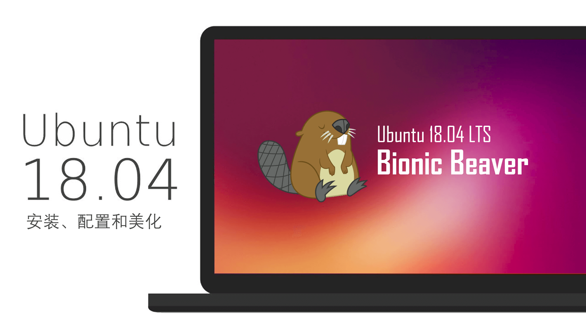
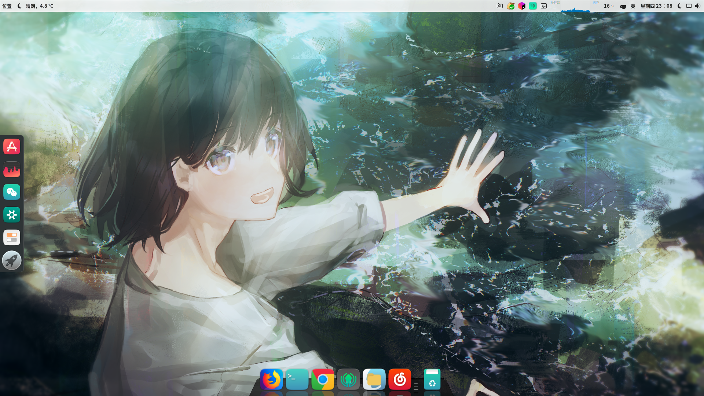
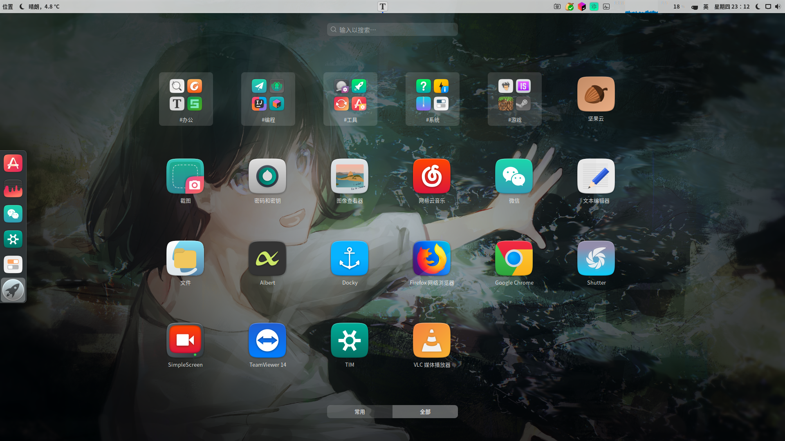
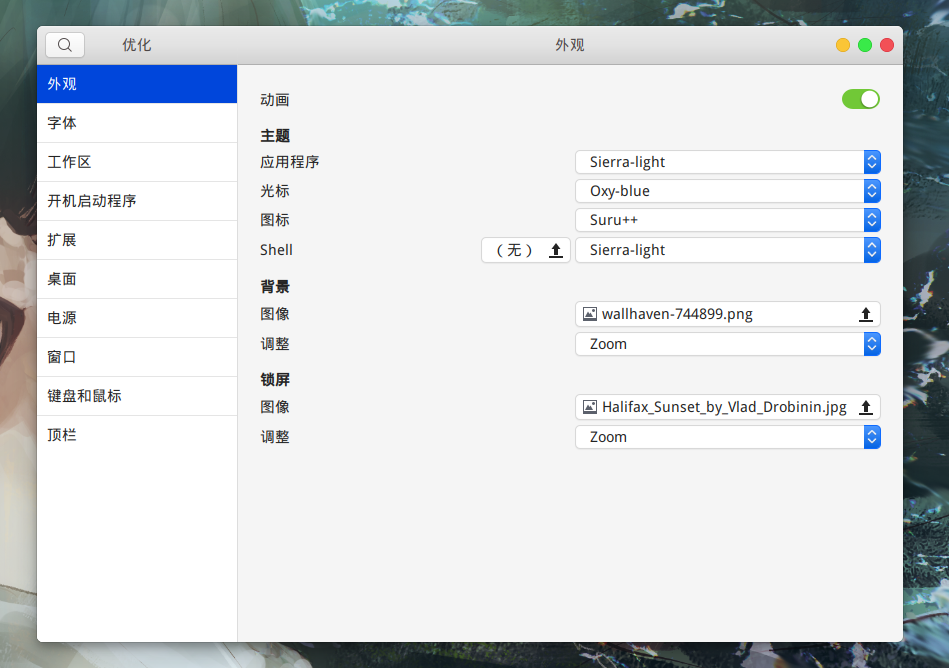
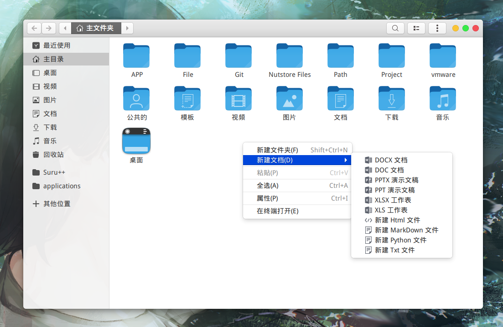

- 概述：系统性的介绍 Ubuntu 18.04 LTS X86_64 的安装过程 :two_hearts:。
- 简介：日常使用环境的搭建，内容上包括：系统安装、配置、美化和软件安装说明。
- 定位：新手向，含有一定解释性说明，线性搭建版本：[记一次Ubuntu系统搭建过程](https://github.com/inkss/markdown/blob/master/Linux/Ubuntu/%E8%AE%B0%E4%B8%80%E6%AC%A1Ubuntu%E7%B3%BB%E7%BB%9F%E6%90%AD%E5%BB%BA%E8%BF%87%E7%A8%8B.md) 。
- 协议：本文章使用 [CC BY-NC-SA 4.0](https://creativecommons.org/licenses/by-nc-sa/4.0/deed.zh) 协议。

------

## 一、安装操作系统

> 概括下介绍 Ubuntu 操作系统的安装，仅供参考。

### 1.1 引导盘

>  **统一可扩展固件接口**（英语：Unified Extensible Firmware Interface，缩写**UEFI**）。

刻录方式：

- **刻录到光盘：**

  - 使用 *[UltraISO](https://www.ultraiso.com/download.html)* 对镜像文件进行刻录，同时存在 Legacy , UEFI 两种引导项，通过 UEFI 形式读入光盘。

- **刻录到 U 盘：**

  - **方案一：解压镜像文件** 【**推荐**】

    准备一个干净的 **FAT32** 格式的 U 盘，使用压缩工具对 Ubuntu 的镜像文件进行解压，解压目录为 U 盘根目录，之后重启电脑引导进入 U 盘即可。

  - **方案二：使用刻录工具**

    Ubuntu 官网中推荐的 U 盘刻录工具为 *[Universal-USB-Installer](https://www.pendrivelinux.com/universal-usb-installer-easy-as-1-2-3/)* ，但是需要注意的是这个工具刻录后的 U 盘只有 Legacy 引导 ，所以只能放弃该软件，这里选用另一款 U 盘刻录工具：*[Rufus](https://rufus.akeo.ie/?locale=zh_CN)* ，具有 **免安装、绿色版、支持 UEFI** 的特性。

### 1.2 分区

基本思路：利用 Windows 系统中的磁盘管理工具压缩出一个新分区给 Ubuntu 使用。

打开 Windows 的文件管理器（快捷键 Win + E），展开顶部选择 **计算机**→**管理**。

然后选择 **磁盘管理工具** ，对相应分区进行压缩（所谓压缩分区也可视为切割分区）。

> 备注1：压缩后的新分区 **不要新建简单卷或格式化** 。

> 备注2：单系统需求用户可忽略此步骤。

### 1.3 安装系统

正常的安装过程，诸如对 BIOS 进行设置之类，网上教程很多，这里不多赘述。

在到 *安装类型* 这一步骤时，如果你在上一步压缩完分区后，没有新建简单卷（保持未分配状态），那么就只需选择 **安装 Ubuntu，与 Windows boot manager 共存** 这一选项，将分区相关事宜交由 Ubuntu 处理。

而如果需要自主划分分区，选择 *其他选项* 。分区只推荐划分出根 `/` 和家目录 `/home` 。

> 注意1：为了系统的稳定，安装过程中请连上网络，勾选 **安装 Ubuntu 时下载更新** 。

> 注意2：安装时选择 **最小安装** ，可以避免安装诸如：雷鸟、LibreOffice  之类的软件。

> 注意3：关于交换分区（Swap 分区），可以使用 swap 文件代替 swap 分区。

> 注意4：UEFI 模式，记得准备一个 **EFI** **(ESP)** 分区，否则无法写入 Grub 引导项。

------

## 二、开箱即用的操作系统

> 遗憾的是，Ubuntu 的开箱体验极差，对一个新手来说更适合选用的操作系统是 Deepin 。

> 本节可以按照线性顺序进行，不过实际安装过程中，限于网速多半会先安装 Chrome 和 SSR （相关内容在第三节）。此外操作系统中自带的火狐浏览器为国际版，而非国内谋智的火狐，两者账户是不互通的。

### 2.1 第一次重启前

- **1.完成第一次更新**

先移步到 **所有软件 (Win + A)**→**软件更新器** ，等待系统完成更新。（其实等待一会儿会自动弹出的）

接着移步到 **所有软件**→**设置**→**区域和语言**→**管理已安装的语言** ，完成语言列表的更新。

- **2.转移备份文件**

在选择重启操作系统前，拷贝文件到新系统中（如果存在的话）。

- **3.解决双系统时差问题**

Windows + Linux 需求用户可以使用以下代码在终端中执行解决此问题。

```sh
timedatectl set-local-rtc 1 --adjust-system-clock
```

- **4.替换终端**

不得不说，有一个智能的补全能力强大的终端还是非常有必要的，二选一。

(a). oh-my-zsh

```sh
sudo apt install git
sudo apt install zsh
wget https://github.com/robbyrussell/oh-my-zsh/raw/master/tools/install.sh -O - | sh
chsh -s /usr/bin/zsh
```

(b). fish

```sh
sudo apt-add-repository ppa:fish-shell/release-2
sudo apt-get update
sudo apt-get install fish
chsh -s /usr/bin/fish
```

```sh
set fish_greeting 
fish_config
```

- **5.终端下的安装器**

相比于图形界面 ，在终端下安装 deb 包可以获得更多的信息提示，但是使用 `dpkg` 命令又无法自动解决依赖问题，所以这里使用 `gdebi` 安装器替代以上两者。

```sh
sudo apt install gdebi
```

### 2.2 换一套主题

>  此节是为伸手党准备的，详细的内容可参见 `2.3 主题自定义` （新手可以不必去看）。

- **系统主题 Sieera** ：[Sierra-light.tar.xz](https://www.opendesktop.org/c/1460761561)，解压文件到：`~/.themes`
- **鼠标光标 oxy-blue** ：[oxy-blue.zip](https://www.opendesktop.org/p/1274872/)，解压文件到：`~/.icons`
- **应用图标 suru-plus** ：`wget -qO- https://raw.githubusercontent.com/gusbemacbe/suru-plus/master/install.sh | env DESTDIR="$HOME/.icons" sh`
- **Grub 主题 Fallout** ：`wget -O - https://github.com/shvchk/fallout-grub-theme/raw/master/install.sh | bash`
- **文泉驿字体 微米黑/正黑**：`sudo apt install fonts-wqy-microhei fonts-wqy-zenhei`
- **终端字体 powerline** ：`sudo apt-get install fonts-powerline`

- **安装优化工具：**

```sh
sudo apt install gnome-tweak-tool
sudo apt install gnome-shell-extensions
```

然后，从应用列表中打开一个名为 **优化** 的软件，在外观中修改：应用程序、光标、图标和 Shell 就大功告成了，最后不要忘记换一个赏心悦目的桌面背景。

### 2.3 主题自定义

- **1.Gnome-tweak-tool**

Ubuntu 18.04 抛弃了 Unity ，转而使用 Gnome ，故先安装以下工具：

```sh
sudo apt install gnome-tweak-tool
```

然后移步到 **所有软件**→**Ubuntu 软件**→**附加组件** ，在此处安装相应的 Shell 组件。

为了自定义 Shell 主题，需要安装、启用插件：*User Themes（如此才可以修改 shell 样式，也就是顶栏）*

附录资源下载网站：[Gnome-look](https://www.gnome-look.org/) ，主题、图标等均能在其网站中下载到。

- **2.主题 图标 字体**

安装目录有两种，区别上类似于 Windows 环境变量里的个人和系统。

1. 主题存放目录：`/usr/share/themes` 或 `~/.themes`
2. 图标存放目录：`/usr/share/icons` 或 `~/.icons`
3. 字体存放目录：`/usr/share/fonts` 或 `~/.fonts`

其中 */usr/share* 目录需要 root 权限才能修改，可以对文件管理提权后打开：

```sh
sudo nautilus
```

- **3.Grub 启动项主题**

主题包地址：[Gnome Look - GRUB Themes](https://www.gnome-look.org/browse/cat/109/order/latest) （自行挑选喜欢的）

**安装步骤** ：

首先下载主题包，多为压缩包，解压出文件。使用 `sudo nautilus` 打开文件管理器。

定位到目录：`/boot/grub`，在该目录下 **新建文件夹** ：`themes`，把解压出的文件拷贝到文件夹中。

(a). 方案一：手写配置文件

接着（终端下）使用 gedit 修改 *grub* 文件：

```sh
sudo gedit /etc/default/grub
```

在该文件末尾添加：

```sh
# GRUB_THEME="/boot/grub/themes/主题包文件夹名称/theme.txt"
GRUB_THEME="/boot/grub/themes/fallout-grub-theme-master/theme.txt"
```

更新配置文件：

```sh
sudo update-grub
```

(b). 方案二：利用软件 Grub Customizer

添加 PPA ：

```sh
sudo add-apt-repository ppa:danielrichter2007/grub-customizer
```

安装软件：

```sh
sudo apt install grub-customizer
```

使用该软件定制 Grub 。

- **4.GDM 登录背景图**

更换登录界面的背景图需要修改文件 `ubuntu.css`，它位于 `/usr/share/gnome-shell/theme` 。

```sh
sudo gedit /usr/share/gnome-shell/theme/ubuntu.css
```

在文件中找到关键字 `lockDialogGroup`，如下行：

```sh
#lockDialogGroup {
   background: #2c001e url(resource:///org/gnome/shell/theme/noise-texture.png);
   background-repeat: repeat; }
```

修改图片路径即可，样例如下：

```sh
#lockDialogGroup {
background: #2c001e url(file://home/inkss/APP/ink_img/img.jpg);
   background-repeat: no-repeat; 
   background-size: cover;
   background-position: center; }
```

- **5.输入法：搜狗输入法**

Ubuntu 18.04 没有提供 Fcitx 输入框架，先安装框架：

```sh
sudo apt install fcitx
```

去 [搜狗输入法官网](https://pinyin.sogou.com/linux/?r=pinyin) 下载输入法安装包安装：

```sh
sudo gdebi xxxxxx.deb
```

然后移步到 **设置**→**区域和语言** ，删除一部分输入源，只保留汉语，接着选择 **管理已安装的语言** ，修改 *键盘输入法系统* 为 **fcitx** 。关闭窗口，打开所有程序，选择软件  **Fcitx 配置** ，选择加号添加搜狗输入法。

> 如果没有找到搜狗，就重启系统，再次重复以上步骤即可。
>
> 推荐一个搜狗输入法皮肤：[简约-信](https://pinyin.sogou.com/skins/detail/view/info/519557?rf=subject_jjzq&tf=p) 。

- **6.Dock ：Docky**

一个第三方 Dock 软件，颜值上比 Ubuntu 自带 Dock 好了些许。

```sh
sudo apt install docky
```

【可选】如何 [*去掉 Docky 第一个图标*](https://my.oschina.net/ic4907/blog/158747)

在 **Ubuntu SoftWare** 中搜索 *Configuration Editor* ，安装后打开软件，定位到：

**`/apps/docky-2/Docky/Items/DockyItem`**

取消 *ShowDockyItem* 的勾选状态（决定是否显示 第一个 Docky）

------

## 三、后续完善

> 此节内容可跳跃观看，仅供参考，合理辨认是否过时。

###  3.1 DeepinWine Wine QQ 

首先需要在本机下载 Deepin-Wine 环境：[**deepin-wine-ubuntu**](https://github.com/wszqkzqk/deepin-wine-ubuntu)

克隆或下载压缩包到本机，**解压后** 在终端目录下执行命令：`./install.sh` 安装环境。

容器下载地址：[Index of /deepin/pool/non-free/d/](http://mirrors.aliyun.com/deepin/pool/non-free/d/) ，使用方法见仓库中的 [ReadMe](https://github.com/wszqkzqk/deepin-wine-ubuntu/blob/master/README.md) 文件。

> **关于托盘**：安装 *TopIconPlus* 的 gnome-shell 扩展。
>
> 然后在所有软件中找到 **优化 (Gnome-tweak-tool)** ，在扩展中打开 *Topicons plus* 。
>

### 3.2 Gnome 扩展

获取扩展的方法很多：终端命令，软件中心下载，浏览器下载等，这里主要涉及浏览器下载。

首先安装 Gnome Shell ：

```sh
sudo apt install chrome-gnome-shell
```

然后安装浏览器插件（**谷歌浏览器**）：[Chrome 网上应用商店](https://chrome.google.com/webstore/detail/gnome-shell-integration/gphhapmejobijbbhgpjhcjognlahblep) 。

无条件的同学可以使用火狐浏览器安装扩展：[GNOME Shell integration](https://addons.mozilla.org/zh-CN/firefox/addon/gnome-shell-integration/?src=search) 。

浏览器插件安装完成后点击 *插件图标* 就能进入：**[Shell 扩展商店](https://extensions.gnome.org/)** 。

**Gnome 扩展推荐**（点击链接进入，按需使用） :

| 扩展                                                         | 简要功能描述                         |
| :----------------------------------------------------------- | :----------------------------------- |
| [Appfolders Management extension](https://extensions.gnome.org/extension/1217/appfolders-manager/) | 添加文件夹                           |
| [Applications Menu](https://extensions.gnome.org/extension/6/applications-menu/) | 在顶部添加一个应用程序入口           |
| [Autohide Battery](https://extensions.gnome.org/extension/595/autohide-battery/) | 自动隐藏电源（充电状态下已满）       |
| [Caffeine](https://extensions.gnome.org/extension/517/caffeine/) | 取消自动锁屏（应用前台允许下）       |
| [Clipboard Indicator](https://extensions.gnome.org/extension/779/clipboard-indicator/) | 剪切板管理工具                       |
| [Coverflow Alt-Tab](https://extensions.gnome.org/extension/97/coverflow-alt-tab/) | Alt Tab 切换应用（更酷炫的界面）     |
| [Dash to Dock](https://extensions.gnome.org/extension/307/dash-to-dock/) | Dock （大名鼎鼎）                    |
| [Dash to Panel](https://extensions.gnome.org/extension/1160/dash-to-panel/) | 对顶栏的操作处理（诸如自动隐藏等）   |
| [EasyScreenCast](https://extensions.gnome.org/extension/690/easyscreencast/) | 录屏工具（录制质量优秀）             |
| [Extension update notifier](https://extensions.gnome.org/extension/1166/extension-update-notifier/) | 自动推送所有扩展的更新信息           |
| [Hide Top Bar](https://extensions.gnome.org/extension/545/hide-top-bar/) | 全屏时自动隐藏顶栏                   |
| [Internet speed meter](https://extensions.gnome.org/extension/1461/internet-speed-meter/) | 顶栏显示当前网络速度                 |
| [Keys Indicator](https://extensions.gnome.org/extension/1105/keys-indicator/) | 顶栏显示 shift,alt,ctrl,num,cap 状态 |
| [Never close calendar event](https://extensions.gnome.org/extension/1439/never-close-calendar-event/) | 从不清除日历事件                     |
| [No Topleft Hot Corner](https://extensions.gnome.org/extension/118/no-topleft-hot-corner/) | 清楚左上角的活动热区                 |
| [OpenWeather](https://extensions.gnome.org/extension/750/openweather/) | 顶栏显示天气情况（支持中文）         |
| [Places Status Indicator](https://extensions.gnome.org/extension/8/places-status-indicator/) | 提供快捷目录入口（同文件管理器）     |
| [Popup dict Switcher](https://extensions.gnome.org/extension/1349/popup-dict-switcher/) | 一键开关划词翻译                     |
| [Removable Drive Menu](https://extensions.gnome.org/extension/7/removable-drive-menu/) | 移除可移动设备                       |
| [Screenshot Tool](https://extensions.gnome.org/extension/1112/screenshot-tool/) | 截图工具（挺方便）                   |
| [Sound Input & Output Device Chooser](https://extensions.gnome.org/extension/906/sound-output-device-chooser/) | 更方便的调整声音、亮度               |
| [System-monitor](https://extensions.gnome.org/extension/120/system-monitor/) | 在状态栏中显示系统信息（很多类型）   |
| [TaskBar](https://extensions.gnome.org/extension/584/taskbar/) | 类似于 Windows 任务栏的显示效果      |
| [Time ++](https://extensions.gnome.org/extension/1238/time/) | 番茄钟（闹钟、秒表、计时器）         |
| [TopIcons Plus](https://extensions.gnome.org/extension/1031/topicons/) | 顶栏显示应用图标（托盘显示）         |
| [User Themes](https://extensions.gnome.org/extension/19/user-themes/) | 允许本地安装使用 Shell 主题          |

> 以上表格提到的所有扩展都能在 Ubuntu 18.04 中使用，若出现安装失败，请检查 **是否满足相关依赖** 。

### 3.3 Snap 安装软件

* 登录 Snap Store（这个账户是你的 UBuntu One 账户（https://login.ubuntu.com/+login ）

```sh
sudo snap login xxxxx@gmail.com
```

- 退出账户

```sh
snap logout
```

Snap 通常从 Snap Store 安装。您可以在不登录的情况下与 Snap Store 进行交互，但登录可提供许多优势。这些优势包括能够访问您的私人快照和管理快照而无需设备上的 root 。概括来说：**可以不登录，但是大部分命令就需要使用 sudo ，登录账户后则无需使用**。此外登录账户后才可以发布 snap 包。

PS：在应用商店里可以搜索、安装、下载到基于 snap 的软件，所以下列内容仅供参考。

```sh
snap find <query>    # 查找
snap install <snap>  # 安装
snap remove <snap>   # 删除
snap revert <snap>   # 还原
snap disable <snap>  # 禁用
snap enable <snap>   # 启用
```

* 更多 snap 的命令用法可在终端下：`man snap` 查看，或者浏览器访问：[snap: command reference](https://docs.snapcraft.io/reference/snap-command)

> 与软件中心安装相比，终端下可以看到下载速度，排解一下等待的烦恼。

### 3.4 文件备份合集

- **1.本地同步备份**

[**FreeFileSync**](https://freefilesync.org/) 是一款本地同步 **备份** 软件：如将本地硬盘上的文件同步到移动硬盘上。可以做到增量备份、自动识别差异项等。同步方式有：*双向、镜像、更新* 。下载地址：[Download FreeFileSync](https://freefilesync.org/download.php) ，Linux 版本下载文件为一个压缩包，解压后直接点击 *FreeFileSync* 文件就能使用。

因为没有图标，这里给出写入图标的方式（有工具就绝对不手写）：

```sh
# –-no-install-recommends 参数避免安装非必须的文件，从而减小体积
sudo apt install --no-install-recommends gnome-panel
```

创建应用程序启动方式

```sh
sudo gnome-desktop-item-edit /usr/share/applications/ --create-new
```

命令：点浏览展开到解压目录，选择 *FreeFileSync* 的可执行文件。

图标：解压包中有一个名为 *Resources.zip* 的压缩包，含有一些图片，从中选取软件图标。

- **2.云端同步备份**

[**坚果云**](https://www.jianguoyun.com/) 是一款云端 **同步** 软件，与同类的 *OneDrive* 相比，坚果云做到了全平台兼容。

其免费版本流量限制、空间不限（下载 3G/月，上传 1G/月）；专业版一年 42G 空间、不限流量，*199.90* 元（*差不多是处于打折状态下 Office 365 的价格，有 1T OneDrive 空间*）。

下载地址：[坚果云 Linux 版](https://www.jianguoyun.com/s/downloads/linux) （普通的 deb 安装包）

- **3.局域网文件互传**

**Chfs** 是一个免费的、HTTP 协议的文件共享服务器，使用浏览器可以快速访问。它具有以下特点：

1. **单个文件**，整个软件只有一个可执行程序，无配置文件等其他文件
2. 跨平台运行，支持主流平台：Windows，Linux 和 Mac
3. 支持扫码下载和手机端访问，手机与电脑之间共享文件非常方便
4. 支持账户权限控制和地址过滤

下载地址：[CuteHttpFileServer](http://iscute.cn/chfs) ，使用方案见网站说明。

- **4.在线文件管理器**

基于 **Caddy** 的 **FileBrowser** 模块，除此之外还可以使用 webdav 模块启用 webdav 功能。

安装 Caddy

```sh
curl https://getcaddy.com | bash -s personal http.filebrowser
```

新建配置文件 `Caddyfile` ，文件位置 `/home/ubuntu/caddy/Caddyfile`

```sh
:8080 {
  gzip
  timeouts none
  filebrowser / / {
    database /home/ubuntu/caddy/filebrowser.db
  }
}
```

以上写法的作用是通过 IP 的 `8080` 端口访问网页，这个 IP 既可以是公网 IP 也可以是内网 IP 。具体的文件路径可以在登录网页后在网站设置内手动修改，数据库的存放目录要灵活自己选择，配置文件的存放目录同样可以自拟。

在 `/home/ubuntu/caddy/` 目录下打开终端，执行命令：`caddy` ，终端提示错误忽略即可。

打开网址：http://localhost:8080 访问，默认的用户名和密码均为：`admin` （可以手写一个脚本自动运行）。

**更多的内容可以参看这篇实验：**[基于 Caddy 搭建基于网页的文件共享管理系统](http://link.zhihu.com/?target=https%3A//cloud.tencent.com/developer/labs/lab/10453) 。

相关文档：[FileBrowser # caddy](https://docs.filebrowser.xyz/installation#caddy) 。

- **5.系统快照备份**

制作快照的软件 **TimeShift** ，可以对整个分区进行备份，以分区为单位进行恢复。这里安装它即可：

```sh
sudo apt install timeshift
```

### 3.5 网易云音乐

> 在写这篇文章时，操作系统为：`Ubuntu 18.04.1 LTS x86_64` ；网易云音乐为：`1.1.0`

首先去网易云音乐官网 [下载安装包](https://music.163.com/#/download)（Ubuntu 16.04 64 位），然后就是正常的 deb 包安装过程。

安装完毕后，会发现在应用列表中 **点击应用图标无法启动软件** ，解决方案：

- 修改网易云音乐的启动图标

```sh
sudo gedit /usr/share/applications/netease-cloud-music.desktop
```

- 修改 Exec 这一行内容

```sh
Exec=sh -c "unset SESSION_MANAGER && netease-cloud-music %U"
```

- 附录：网易云音乐配置及缓存目录

```sh
~/.config/netease-cloud-music
~/.cache/netease-cloud-music
```

> 参考资料地址：[Ubuntu 18.04 装了网易云音乐，难道只能用 sudo 启动吗？- @Fancy 解答](https://www.zhihu.com/question/277330447/answer/478510195)

### 3.6 触摸板手势

触摸板手势这里有两个选择： [touchegg](https://github.com/JoseExposito/touchegg) 和 [libinput-gestures](https://github.com/bulletmark/libinput-gestures)

touchegg 从提交记录上看似乎有些年代偏久了，而且 Issues 也有一堆问题，所以这里选用 libinput-gestures 。

**安装步骤：**

- 加入用户组，完成之后重启操作系统

```sh
sudo gpasswd -a $USER input
```

- 安装

```sh
sudo apt install libinput-tools
git clone https://github.com/bulletmark/libinput-gestures.git
cd libinput-gestures
sudo make install # (or sudo ./libinput-gestures-setup install)
```

- 启动

```sh
libinput-gestures-setup start
libinput-gestures-setup autostart
```

- 停止

```sh
libinput-gestures-setup stop
libinput-gestures-setup autostop
```

- 卸载

```sh
libinput-gestures-setup stop
libinput-gestures-setup autostop
sudo libinput-gestures-setup uninstall
```

### 3.7 部分软件

- **1.SSR**

> 地址：[erguotou520](https://github.com/erguotou520)/**[electron-ssr](https://github.com/erguotou520/electron-ssr)** 。这是一个跨平台（支持Windows MacOS Linux系统）的客户端桌面应用，它功能丰富，支持 windows 版大部分功能，更有更多人性化功能。它是开源的，它来源于开源，回馈以开源。

- **2.Chrome**

```sh
sudo wget http://www.linuxidc.com/files/repo/google-chrome.list -P /etc/apt/sources.list.d/
wget -q -O - https://dl.google.com/linux/linux_signing_key.pub | sudo apt-key add -
sudo apt update
sudo apt install google-chrome-stable
```

- **3.Typora**

```sh
wget -qO - https://typora.io/linux/public-key.asc | sudo apt-key add -
sudo add-apt-repository 'deb https://typora.io/linux ./'
sudo apt update
sudo apt install typora
```

- **4.Albert**

```sh
sudo apt install curl
curl https://build.opensuse.org/projects/home:manuelschneid3r/public_key | sudo apt-key add -
wget -nv https://download.opensuse.org/repositories/home:manuelschneid3r/xUbuntu_18.04/Release.key -O Release.key
sudo apt-key add - < Release.key
sudo apt-get update
```

- **5.popup-dict**

 Linux 下的划词翻译工具，支持使用有道等多种翻译服务。

功能特点：

1. 目前只支持英文->中文翻译，支持单词和短语
2. 主要针对 Gnome 桌面环境，不保证其它环境下的正常使用
3. 鼠标划词翻译，弹窗显示
4. 智能处理选中内容（去除两端非英文字符、压缩空白字符、删除换行符等）
5. 弹窗显示一段时间后自动关闭。若鼠标在弹窗中，延迟关闭
6. 点击弹窗中链接可打开有道词典网页版

安装过程：

- 安装 pip3 ，如果已有请忽略此步骤

```sh
sudo apt install python3-pip
```

- 安装 PyGObject 依赖

```sh
sudo apt install python3-gi python3-gi-cairo gir1.2-gtk-3.0
sudo apt install libgirepository1.0-dev gcc libcairo2-dev pkg-config python3-dev gir1.2-gtk-3.0
```

- 安装 popup-dict

```sh
sudo pip3 install popupdict
```

运行软件：使用 Gnome 扩展  [`Popup dict Switcher`](https://extensions.gnome.org/extension/1349/popup-dict-switcher/)

------

## 四、补充内容

### 4.1 软件列表

- 音乐软件：网易云音乐、Spotify
- 聊天软件：TIM、微信、Telegram
- 办公软件：WPS、Foxit Reader、 Kile
- 图形软件：Converseen（图片格式转换）、Krita（有点类似 PS）、polarr （泼辣修图）
- 下载软件：aMule（电驴）、Deluge（种子）、qBittorrent（种子）、uGet（有点类似 IDM）
- 截图录屏：深度截图、Shutter、SimpleScreen
- 版本管理：GitKraken、Meld
- 浏览器：Chrome、Firefox
- 软件启动器：Albert
- 应用商店：App Grid
- 剪切板管理：Cliplt
- 网络代理：electron-ssr
- 虚拟键盘：Florence
- 密码管理：KeePassXC

### 4.2 代码篇

**1.软件图标（.desktop）文件位置：**

* `/usr/share/applications` # 大部分启动图标都在此
* `~/.local/share/applications` # 一部分本地图标
* `/var/lib/snapd/desktop/applications` # snap 类软件在此

对于 **.desktop* 文件，可以使用文本编辑器对图标或名称之类的进行修改。

**2.代码篇：**

```bash
# 查看所有 shell 以及如何切换
cat /etc/shells
chsh -s /xxx/xxxx

# 强制清空回收站
sudo rm -rf $HOME/.local/share/Trash/files/*

# 系统环境变量位置
/etc/profile

# 环境变量值 PATH 的一种写法
export PATH=$PATH:变量1:变量2:变量3

# 个人终端下的环境变量
~/.bashrc
~/.zshrc

# MySQL 的 root 账户密码
sudo mysql -u root # 使用管理员权限进数据库
DROP USER 'root'@'localhost'; # 删除原数据库中 root 账户
CREATE USER 'root'@'%' IDENTIFIED BY 'passwd'; # 新建并指定密码
GRANT ALL PRIVILEGES ON *.* TO 'root'@'%'; # 赋权
FLUSH PRIVILEGES; # 更新

# 多版本切换（ java 等）
sudo update-alternatives --install <link> <name> <path> <priority>
sudo update-alternatives --remove <name> <path>
sudo update-alternatives --config <name>
```

### 4.3 截图

- **桌面**



- **软件列表**



- **主题配置**



- **文件管理器**



