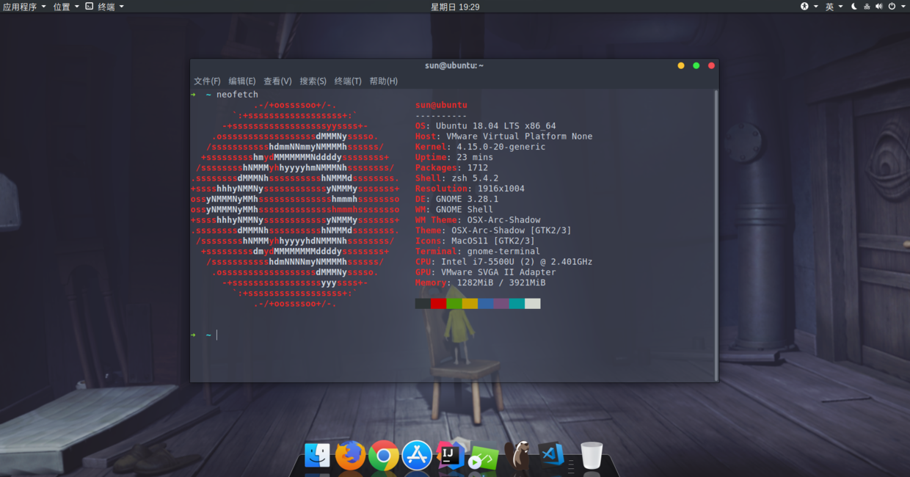

# Ubuntu 18.04 记录



## 一、MySQL 5.7 root 账户密码

使用 `sudo apt install mysql-server` 安装数据库时，没有弹出输入密码的界面，导致无法登录数据库，解决方案如下：

（1）使用 sudo 权限进入数据库

```sh
sudo mysql -u root
```

（2）删除原 root 用户

```sh
DROP USER 'root'@'localhost';
```

（3）新建 root 用户并指定密码

```sh
CREATE USER 'root'@'%' IDENTIFIED BY 'passwd';
```

（4）赋权

```sh
GRANT ALL PRIVILEGES ON *.* TO 'root'@'%';
```

（5）更新权限

```sh
FLUSH PRIVILEGES;
```

## 二、Gnome 桌面美化

（1）安装 ‘优化’ 软件

```sh
sudo apt install gnome-tweak-tool
sudo apt install gnome-shell-extensions
sudo apt install chrome-gnome-shell
```

Gnome 桌面主题网站：[Gnome-look](https://www.gnome-look.org/)

## 三、安装 Shadowsocks-qt5 (仅供参考)

截止到目前，因为作者还未测试 Ubuntu 18.04，所以需要修改 PPA 源。

```sh
------>原来的如下:
http://ppa.launchpad.net/hzwhuang/ss-qt5/ubuntu bionic main
------>改成如下:
http://ppa.launchpad.net/hzwhuang/ss-qt5/ubuntu artful main
```

操作很简单(dan teng),点左下角九个点点,然后找到*软件和更新*->*其他软件*

在这里修改ss-qt5的源,然后继续安装就行了.

---

## 四、可能会用到的软件

(1) Chrome 浏览器

    sudo wget http://www.linuxidc.com/files/repo/google-chrome.list -P /etc/apt/sources.list.d/
    wget -q -O - https://dl.google.com/linux/linux_signing_key.pub | sudo apt-key add -
    sudo apt update
    sudo apt install google-chrome-stable

（2）oh-my-zsh 终端

    sudo apt-get install git
    sudo apt-get install zsh
    wget https://github.com/robbyrussell/oh-my-zsh/raw/master/tools/install.sh -O - | sh
    chsh -s /usr/bin/zsh

（3）Docky

    sudo apt install docky

（4）打开一个root权限的文件管理器

    sudo nautilus

（5）强制清空回收站

    sudo rm -rf $HOME/.local/share/Trash/files/*

（6）文泉译微米黑字体

    sudo apt install fonts-wqy-microhei

---

参考资料

1. [ubuntu 16.04 安装mysql 5.7后无法用普通账号登陆mysql](http://www.phpbug.cn/archives/621.html)

1. [MySQL创建用户与授权](https://www.jianshu.com/p/d7b9c468f20d)

1. [Ubuntu17.10／Ubuntu18.04配置以及美化](https://zhuanlan.zhihu.com/p/35362159)

1. [Linux也可以这样美——Ubuntu18.04安装、配置、美化-踩坑记](https://www.jianshu.com/p/f9e905abea91)

1. [Ubuntu18.04 安装shadowsocks-qt5](https://blog.csdn.net/A807296772/article/details/80112871)

1. [Ubuntu18.04快速安装eclipse](https://blog.csdn.net/qq_34330400/article/details/80112291)

1. [Ubuntu 16.04 LTS如何使用Snap软件包](https://www.sysgeek.cn/use-snap-packages-ubuntu-16-04/)