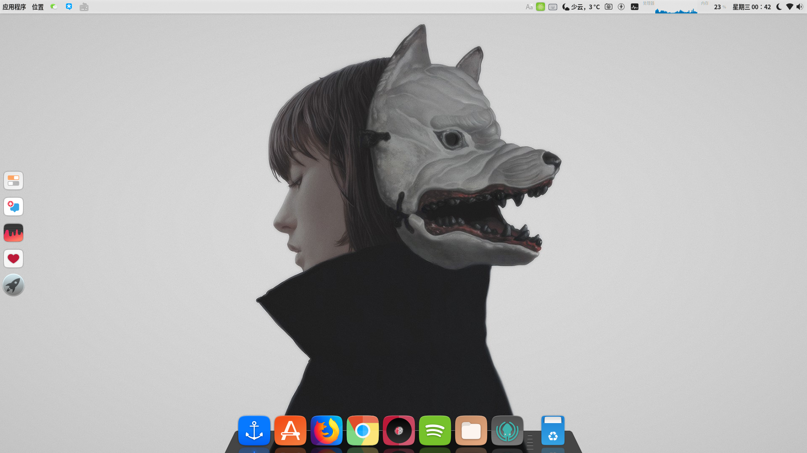
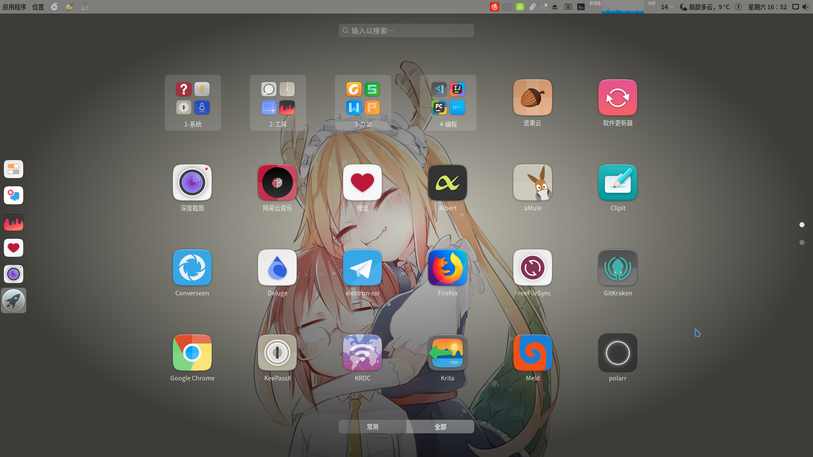
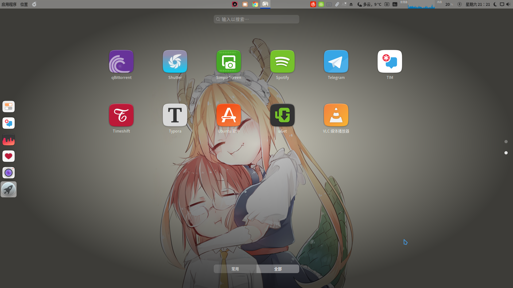
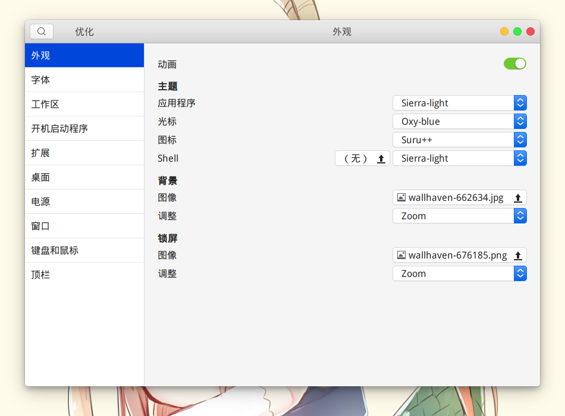
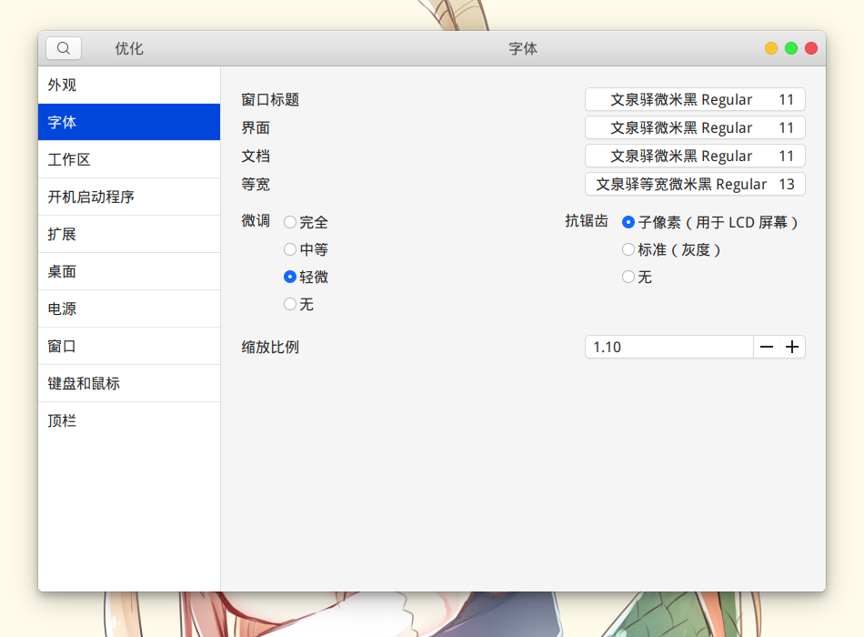
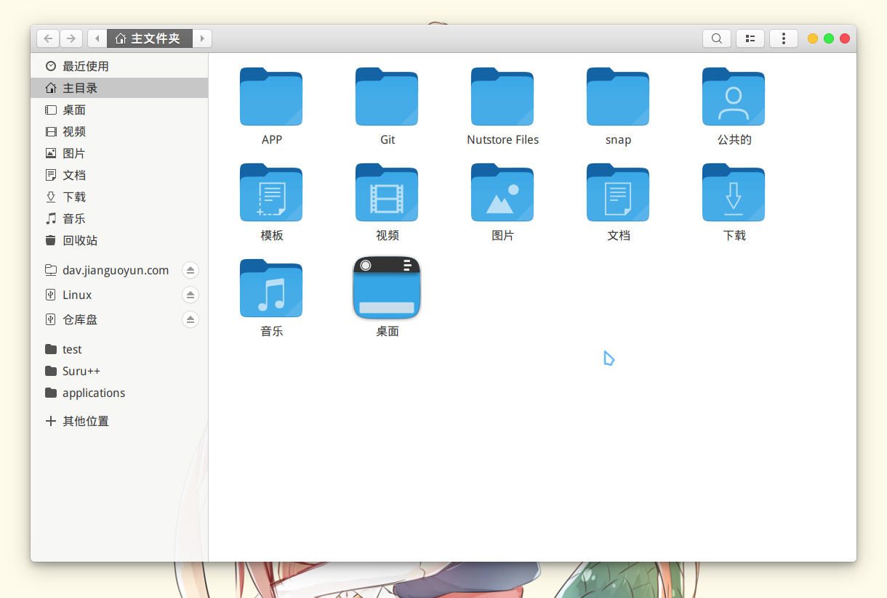

# 记一次 Ubuntu 系统搭建过程

- 文章定位：记录、备份、自用
- 基础环境：Ubuntu 18.04.1

------

## 安装操作系统

- 下载 Ubuntu 镜像：[Download Ubuntu Desktop](https://www.ubuntu.com/download/desktop)
- 解压镜像到 U 盘根目录（FAT32）
- 重启进 U 盘：最小安装、全程联网、下载更新

## 第一次更新

- 正式启动后终端更新：

  ```sh
  sudo apt update
  sudo apt upgrade
  ```

- 更新语言包：设置->区域和语言->管理已安装的语言

## 更换终端

- 换成 oh-my-zsh ：

  ```sh
  sudo apt-get install git
  sudo apt-get install zsh
  wget https://github.com/robbyrussell/oh-my-zsh/raw/master/tools/install.sh -O - | sh
  chsh -s /usr/bin/zsh
  ```

- 重启或注销激活

## 主题、字体、壁纸等

- Gnome-tweak-tool：`sudo apt install gnome-tweak-tool`
- 自定义 Shell ：所有软件(Win+A)->Ubuntu 软件->搜索 "User Themes"->安装扩展
- 下载主题 Sierra ：[Sierra-light.tar.xz](https://www.opendesktop.org/c/1460761561)，解压文件到：`~/.themes`
- 下载光标 oxy-blue ：[oxy-blue.zip](https://www.opendesktop.org/p/1274872/)，解压文件到：`~/.icons`
- 安装图标 suru-plus ：`sudo git clone https://github.com/gusbemacbe/suru-plus.git /usr/share/icons/Suru++`
- 安装 Grub 主题 Fallout ：`wget -O - https://github.com/shvchk/fallout-grub-theme/raw/master/install.sh | bash`
- 安装字体 文泉驿微米黑/正黑：`sudo apt install fonts-wqy-microhei fonts-wqy-zenhei`
- 安装终端字体 powerline ：`sudo apt-get install fonts-powerline`
- 激活自定义 shell ：所有软件->优化->扩展-> User Themes
- 激活主题、字体、图标等：所有软件->优化->外观/字体

## 中文输入法-搜狗

- 安装 Fcitx 框架：`sudo apt install fcitx`
- 下载输入法：[搜狗 for Linux](https://pinyin.sogou.com/linux/?r=pinyin)
- 激活框架：设置->区域和语言->管理已安装的语言->键盘输入法系统：fcitx
- 选择搜狗输入法：所有软件（Win+A）-> Fcitx 配置->搜狗输入法 （多半找不到那就重启）
- 输入法皮肤：[简约-信](http://link.zhihu.com/?target=https%3A//pinyin.sogou.com/skins/detail/view/info/519557%3Frf%3Dsubject_jjzq%26tf%3Dp)
- 输入法字体：文泉驿正黑

## electron

- 下载 electron-ssr：[releases](https://github.com/erguotou520/electron-ssr/releases)
- 依赖检查：终端下输入 `python` 检查是否有输出，没有就安装 python2 或者链接 python3 到 python

## 谷歌浏览器：

```sh
sudo wget http://www.linuxidc.com/files/repo/google-chrome.list -P /etc/apt/sources.list.d/
wget -q -O - https://dl.google.com/linux/linux_signing_key.pub | sudo apt-key add -
sudo apt update
sudo apt install google-chrome-stable
```

## Gnome 扩展

- 安装 Gnome shell：`sudo apt install chrome-gnome-shell`
- 安装浏览器插件：[Chrome 网上应用商店](http://link.zhihu.com/?target=https%3A//chrome.google.com/webstore/detail/gnome-shell-integration/gphhapmejobijbbhgpjhcjognlahblep)
- 自用扩展列表：
  - [Appfolders Management extension](https://extensions.gnome.org/extension/1217/appfolders-manager/)
  - [Applications Menu](https://extensions.gnome.org/extension/6/applications-menu/)
  - [Autohide Battery](https://extensions.gnome.org/extension/595/autohide-battery/)
  - [Coverflow Alt-Tab](https://extensions.gnome.org/extension/97/coverflow-alt-tab/)
  - [Dash to Dock](https://extensions.gnome.org/extension/307/dash-to-dock/)
  - [Dash to Panel](https://extensions.gnome.org/extension/1160/dash-to-panel/)
  - [Extension Update Notifier](https://extensions.gnome.org/extension/1166/extension-update-notifier/)
  - [Keys Indicator](https://extensions.gnome.org/extension/1105/keys-indicator/)
  - [No Topleft Hot Corner](https://extensions.gnome.org/extension/118/no-topleft-hot-corner/)
  - [OpenWeather](https://extensions.gnome.org/extension/750/openweather/)
  - [Places Status Indicator](https://extensions.gnome.org/extension/8/places-status-indicator/)
  - [popup-dict switcher](https://extensions.gnome.org/extension/1349/popup-dict-switcher/)
  - [Removable Drive Menu](https://extensions.gnome.org/extension/7/removable-drive-menu/)
  - [Screenshot Tool](https://extensions.gnome.org/extension/1112/screenshot-tool/)
  - [Sound Input & Output Device Chooser](https://extensions.gnome.org/extension/906/sound-output-device-chooser/)
  - [system-monitor](https://extensions.gnome.org/extension/120/system-monitor/)
  - [TopIcons Plus](https://extensions.gnome.org/extension/1031/topicons/)
  - [User Themes](https://extensions.gnome.org/extension/19/user-themes/)

## 各种软件

- **QQ/WeChat**

  - 下载环境：`git clone https://github.com/wszqkzqk/deepin-wine-ubuntu.git`
  - 执行安装：`./install.sh`
  - 下载容器包（见描述）：[readme.md](.https://github.com/wszqkzqk/deepin-wine-ubuntu/blob/master/README.md)

- **Spotify 播放器**

  - 安装软件：

  ```sh
  sudo apt-key adv --keyserver hkp://keyserver.ubuntu.com:80 --recv-keys 931FF8E79F0876134EDDBDCCA87FF9DF48BF1C90
  echo deb http://repository.spotify.com stable non-free | sudo tee /etc/apt/sources.list.d/spotify.list
  sudo apt update
  sudo apt install spotify-client
  ```

  - snap 打包的安装包不怎么好用

- **网易云音乐**

  - 下载安装包：[网易云音乐](http://link.zhihu.com/?target=https%3A//music.163.com/%23/download)
  - 解决 1.1.0 版本图标 Bug ：

  ```sh
  sudo gedit /usr/share/applications/netease-cloud-music.desktop
  
  # 修改 Exec 这一行内容为：
  Exec=sh -c "unset SESSION_MANAGER && netease-cloud-music %U"
  ```

- **划词翻译**

  - 安装 popup-dict ：

  ```sh
  sudo apt install python3-pip
  sudo apt install python-gi python-gi-cairo python3-gi python3-gi-cairo gir1.2-gtk-3.0
  sudo pip3 install popupdict
  ```

  - 启动工具：[Popup dict Switcher](http://link.zhihu.com/?target=https%3A//extensions.gnome.org/extension/1349/popup-dict-switcher/)

- **软件启动器**
  - Using package managers：

  ```sh
  wget -nv -O Release.key \
    https://build.opensuse.org/projects/home:manuelschneid3r/public_key
  apt-key add - < Release.key
  apt-get update
  ```

  - 安装软件：

  ```sh
  sudo sh -c "echo 'deb http://download.opensuse.org/repositories/home:/manuelschneid3r/xUbuntu_18.04/ /' > /etc/apt/sources.list.d/home:manuelschneid3r.list"
  sudo apt update
  sudo apt install albert
  ```

- **本地同步软件**

  - 下载 FreeFileSync ：[Download FreeFileSync](http://link.zhihu.com/?target=https%3A//freefilesync.org/download.php)
  - 解决程序图标（手动）：

  ```sh
  sudo apt install --no-install-recommends gnome-panel
  sudo gnome-desktop-item-edit /usr/share/applications/ --create-new
  ```

- **MD 编辑软件 Typora**

  ```sh
  sudo apt-key adv --keyserver keyserver.ubuntu.com --recv-keys BA300B7755AFCFAE
  sudo add-apt-repository 'deb https://typora.io/linux ./'
  sudo apt update
  sudo apt install typora
  ```

- **快照软件 timeshift**

  ```sh
  sudo add-apt-repository -y ppa:teejee2008/ppa
  sudo apt update
  sudo apt install timeshift
  ```

- **一句话命令**

  ```sh
  sudo apt install docky
  sudo apt install neofetch
  sudo apt install deluge
  sudo apt install uget
  sudo apt install vim
  sudo apt install vlc
  sudo apt install meld
  sudo apt install openjdk-11-jdk
  sudo apt install simplescreenrecorder
  ```

- **需要下载安装包的软件**

  - WPS：http://www.wps.cn/product/wpslinux
  - 坚果云：https://www.jianguoyun.com/s/downloads
  - 福昕阅读器：https://www.foxitsoftware.cn/downloads/
  - BaiduPCS-Go：https://github.com/iikira/BaiduPCS-Go
  - GitKraken：https://www.gitkraken.com/download/linux-deb

## 环境配置

- **JDK 环境**

  - 下载 JDK 11 ：[jdk-11.0.1_linux-x64_bin.tar.gz](https://www.oracle.com/technetwork/java/javase/downloads/jdk11-downloads-5066655.html)
  - 解压文件到：`/usr/lib/jvm/jdk11`
  - 配置环境变量：

  ```sh
  sudo gedit /etc/profile
  # 打开文本编辑器后，在最下面添加：
  export JAVA_HOME=/usr/lib/jvm/jdk11
  export JRE_HOME=${JAVA_HOME}/jre
  export CLASSPATH=.:${JAVA_HOME}/lib:{JRE_HOME}/lib
  export PATH=$PATH:{JAVA_HOME}/bin:
  
  #然后保存退出
  source /etc/profile
  ```

  - 添加链接：

  ```sh
  sudo update-alternatives --install /usr/bin/java java /usr/lib/jvm/jdk11/bin/java 300
  sudo update-alternatives --install /usr/bin/javac javac /usr/lib/jvm/jdk11/bin/javac 300
  sudo update-alternatives --install /usr/bin/jar jar /usr/lib/jvm/jdk11/bin/jar 300
  ```

  - 手动选择：

  ```sh
  sudo update-alternatives --config xxx
  ```

- **Python 环境**

  - 下载 Anaconda ：[Linux Installer](https://www.anaconda.com/download/#linux)
  - 安装，安装前需要给可执行权限，安装可自定义目录，确认添加环境变量
  - 环境变量，bash -> zsh ，如果完全使用 IDE ，加不加都行
  - env 配置：

  ```sh
  conda create -n your_env_name python=3.7 # 创键环境
  conda activate your_env_name # 激活环境
  ```

- **数据库**

  - MaridDB ： `sudo apt install mariadb-server`
  - WorkBench : `sudo apt install mysql-workbench`
  - root 密码登录：

  ```sh
  sudo mysql -u root # 使用管理员权限进数据库
  DROP USER 'root'@'localhost'; # 删除原数据库中 root 账户
  CREATE USER 'root'@'%' IDENTIFIED BY 'passwd'; # 新建并指定密码
  GRANT ALL PRIVILEGES ON *.* TO 'root'@'%'; # 赋权
  FLUSH PRIVILEGES; # 更新
  ```

- **Hexo | Node.js**
  - 安装 NVM ：`wget -qO- https://raw.github.com/creationix/nvm/master/install.sh | sh`
  - 安装 Node：`nvm install stable`
  - 安装 Hexo：`npm install -g hexo-cli`


## Git 配置

- 生成 key ：`ssh-keygen -t rsa -C "youremail@example.com"`
- 配置用户名：`git config --global user.name "Your Name"`
- 配置邮箱：`git config --global user.email "email@example.com"`
- 测试 Github 联通：`ssh -T git@github.com`
- 将公钥提取出来命名为：`authorized_keys` 扔到服务器的 `~/.ssh` 目录就可以免密登录
- 访问远程主机：`ssh 用户名@域名/IP`

## 编程软件

- Jetbrains 系的软件用 snap 安装比较舒服
- VS code：https://code.visualstudio.com/
- VS code 插件备份：Anaconda Extension Pack、Auto Close Tag、Auto Rename Tag、Beautify、Chinese (Simplified)、Code Runner、Date & Time、Debugger for Chrome、Git History、GitLens、HTML CSS Support、HTML Snippets、Kitty Time、Live Server、Markdown All in One、Markdown Preview Enhanced、markdownlint、Material Icon Theme、Material Theme、Python、YAML Support by Red Hat

## 截图

【桌面】




【软件列表】





【主题字体等】





【文件管理器】

