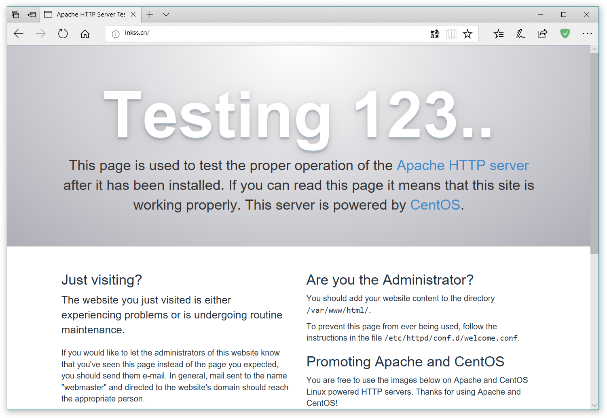
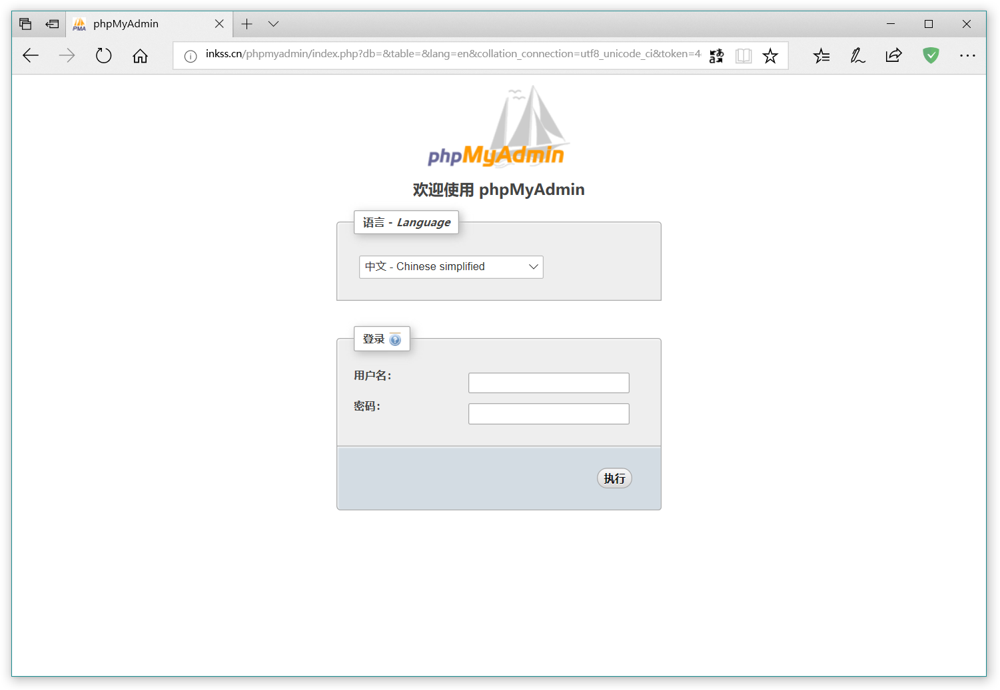

# CentOS PHP环境配置

> 平台：腾讯云
>
> 主机：标准型S2 1核 2GB 50GB 1Mbps
>
> 操作系统：CentOS 7.4 64位

## 1.连接服务器

* SSH类软件：[XShell 5](https://www.netsarang.com/products/xsh_overview.html)

* FTP类软件：[XFtp 5](https://www.netsarang.com/products/xfp_overview.html)

  这两个软件作为一家公司的产品，好处是可以互相调用。对于家庭/学生用户，可以申请免费产品。

注：Xshell如果出现“*所选的用户密钥未在远程主机上注册。请再试一次*”这类提示，主要原因是登录名不正确造成的，对于的腾讯云的基础镜像，CentOS的登录名为root，Ubuntu的登录名为ubuntu。

## 2.安装Apache

（1）安装Apache服务

```ssh
yum install httpd
```

（2）开启Apache服务

```ssh
systemctl start httpd.service
```

（3）设置Apache服务开机启动

```ssh
systemctl enable httpd.service
```

（4）测试验证

在浏览器中输入服务器IP地址（或域名），如果能打开Apache的测试网页则代表成功。



## 3.安装MySQL（MariaDB）

（1）安装MySQL服务

```ssh
yum install mariadb mariadb-server.x86_64
```

（2）开启MySQL服务

```ssh
systemctl start mariadb.service
```

如果启动失败，安装缺失的依赖包，执行下列命令。

```ssh
yum install mariadb‐bench mariadb‐devel mariadb‐embedded mariadb‐libs mariadb mariadb‐server
```

（3）设置MySQL服务开机启动

```ssh
systemctl enable mariadb.service
```

（4）设置root账户密码（初始密码为空）

```ssh
mysql_secure_installation
```

（5）测试验证

登录MySQL验证是否能正常进入。

```ssh
mysql -u root -p
```

## 4.安装PHP

（1）安装PHP服务

```ssh
yum install php
```

（2）安装PHP的MySQL扩展

```ssh
yum install php-mysql
```

（3）安装其他常用PHP模块

```ssh
yum install php‐gd php‐ldap php‐odbc php‐pear php‐xml php‐xmlrpc php‐mbstring php‐snmp php‐soap curl curl‐devel php‐imap
```

（4）重启Apache服务

```ssh
systemctl restart httpd.service
```

（5）测试验证

使用Vim新建一个php页面

```ssh
vim /var/www/html/info.php
```

文件内容如下：

```php
<?php phpinfo(); ?>
```

保存之后，使用浏览器访问/info.php页面，如果能显示PHP的信息，则验证成功。


## 5.安装PhpMyAdmin

（1）安装

```ssh
yum install phpmyadmin php-mcrypt
```

同时会在 Apache 的配置文件目录中自动创建虚拟主机配置文件 /etc/httpd/conf.d/phpMyAdmin.conf（区分大小写）。默认情况下，CentOS 上的phpMyAdmin只允许从回环地址(127.0.0.1)访问。

（2）配置远程访问

修改配置文件

```ssh
vim /etc/httpd/conf.d/phpMyAdmin.conf
```

文件内容更改如下：

```vim
<Directory /usr/share/phpMyAdmin/>
   AddDefaultCharset UTF-8

   <IfModule mod_authz_core.c>
     # Apache 2.4
     <RequireAny>
   #    Require ip 127.0.0.1   #注释掉
   #    Require ip ::1         #注释掉
        Require all granted    #新添加
     </RequireAny>
   </IfModule>
   <IfModule !mod_authz_core.c>
     # Apache 2.2
     Order Deny,Allow
     Deny from All
     Allow from 127.0.0.1
     Allow from ::1
   </IfModule>
</Directory>

<Directory /usr/share/phpMyAdmin/setup/>
   <IfModule mod_authz_core.c>
     # Apache 2.4
     <RequireAny>
   #    Require ip 127.0.0.1   #注释掉
   #    Require ip ::1         #注释掉
        Require all granted    #新添加
     </RequireAny>
   </IfModule>
   <IfModule !mod_authz_core.c>
     # Apache 2.2
     Order Deny,Allow
     Deny from All
     Allow from 127.0.0.1
     Allow from ::1
   </IfModule>
</Directory>
```

重启Apache服务器

```ssh
systemctl restart httpd.service
```

（3）测试验证

使用浏览器访问IP/phpmyadmin页面，如果能正常打开登录，则验证成功。



## 6.配置Https链接

（1）安装SSL

```ssh
yum install mod_ssl openssl
```

（2）安装证书

下载证书文件并上传到服务器中，修改配置文件

```ssh
vim /etc/httpd/conf.d/ssl.conf
```

修改对应字段内容：

```vim
ServerName www.domain.com #配置域名
SSLEngine on
SSLCertificateFile /usr/local/apache/conf/2_www.domain.com_cert.crt #证书公钥
SSLCertificateKeyFile /usr/local/apache/conf/3_www.domain.com.key   #证书私钥
SSLCertificateChainFile /usr/local/apache/conf/1_root_bundle.crt    #证书链
```

重启Apache服务器

```ssh
systemctl restart httpd.service
```

（3）配置全站Http转Https

3.1 修改配置文件

```ssh
vim /etc/httpd/conf/httpd.conf
```

修改AllowOverride字段值:

```vim
<Directory "/var/www/html">
  ...
  AllowOverride All  #原来是None，需要改成All
  ...
</Directory>
```

3.2 在80端口的网站根目录/var/www/html下新建文件

```ssh
vim /var/www/html/.htaccess
```

添加文件内容：

```vim
RewriteEngine on
RewriteBase /
RewriteCond %{SERVER_PORT} !^443$
RewriteRule ^.*$ https://%{SERVER_NAME}%{REQUEST_URI} [L,R]
```

重启Apache服务器

```ssh
systemctl restart httpd.service
```

（4）测试验证

浏览器输入http开头的域名，观察浏览器地址是否跳转为https链接。


---

参考资料：

1. [ECS CentOS7.4环境搭建（Apache+PHP+Mariadb+FTP+phpmyadmin）](https://www.jianshu.com/p/6d04c9fc9051)

1. [Apache配置http访问转https（widows和linux通用）](https://blog.csdn.net/gjkun0202/article/details/71562791)

1. [证书安装指引](https://cloud.tencent.com/document/product/400/4143)