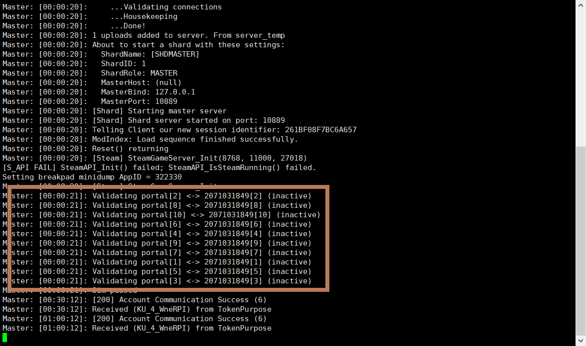

# Ubuntu Server 搭建饥荒服务端

> 平台：腾讯云
>
> 主机：标准型S2 1核 2GB 50GB 1Mbps
>
> 操作系统：Ubuntu Server 16.04.1 LTS 64位

## 1.本地准备

（1）获取cluster_token、UserID

打开饥荒联机版，点击游戏界面右下账户打开个人信息界面：


点击Generate Server Token获取cluster_token，同时也记录UserID值。

（2）游戏配置文件（本地进行）

* 在本地新建 `MyDediServer` 目录。

* 在 MyDediServer 目录下新建 `cluster_token.txt` 文件，将上一步获取到的cluster_token复制到文件内。

* 在 MyDediServer 目录下新建 `adminlist.txt` 文件，将上一步获取到的UserID复制到文件内。

* 在 MyDediServer 目录下新建 `cluster.ini` 文件，内容如下：

```ini
[GAMEPLAY]
max_players = 6
pvp = false
game_mode = endless
pause_when_empty = true
vote_kick_enabled = true

[NETWORK]
cluster_description = 服务器描述
cluster_name = 服务器名称
cluster_password = 服务器密码
cluster_intention = cooperative

[MISC]
max_snapshots = 6
console_enabled = true

[SHARD]
shard_enabled = true
bind_ip = 127.0.0.1
master_ip = 127.0.0.1
master_port = 10889
cluster_key = supersecretkey
```

* 在 MyDediServer 目录下新建 `Caves` 和 `Master` 目录

* 在 Caves 目录下新建 `server.ini` 文件，内容如下：

```ini
[NETWORK]
server_port = 11001

[SHARD]
is_master = false
name = Caves

[STEAM]
master_server_port = 27019
authentication_port = 8769

[ACCOUNT]
encode_user_path = true
```

* 在 Caves 目录下新建 `worldgenoverride.lua` 文件，内容如下：

```lua
return {
    override_enabled = true,
    preset = "DST_CAVE",
}
```

* 在 Master 目录下新建 `server.ini` 文件，内容如下：

```ini
[NETWORK]
server_port = 11000

[SHARD]
is_master = true

[STEAM]
master_server_port = 27018
authentication_port = 8768

[ACCOUNT]
encode_user_path = true
```

* 在 Master 目录下新建 `worldgenoverride.lua` 文件，内容如下：

```lua
return {
    override_enabled = true,
    preset = "SURVIVAL_TOGETHER",
}
```

截止到目前，你**应该拥有的目录结构**为：

```tree
.
└── MyDediServer
    ├── adminlist.txt
    ├── Caves
    │   ├── server.ini
    │   └── worldgenoverride.lua
    ├── cluster.ini
    ├── cluster_token.txt
    └── Master
        ├── server.ini
        └── worldgenoverride.lua
```

## 2.服务器操作

（1）安装环境依赖

```shell
sudo apt-get install libstdc++6:i386 libgcc1:i386 libcurl4-gnutls-dev:i386 lib32gcc1
```

（2） 安装SteamCMD

```shell
mkdir ~/steamcmd
cd ~/steamcmd
wget https://steamcdn-a.akamaihd.net/client/installer/steamcmd_linux.tar.gz
tar -xvzf steamcmd_linux.tar.gz
```

（3）安装DST饥荒

```shell
./steamcmd.sh
```

此时进入`steam>`模式，依次输入：

```steam
login anonymous
force_install_dir ../dontstarvetogether_dedicated_server
app_update 343050 validate
quit
```

（4）解决lib缺失

```shell
mkdir -p ~/dontstarvetogether_dedicated_server/bin/lib32
ln -s /usr/lib/libcurl.so.4 libcurl-gnutls.so.4
```

（5）上传配置文件

首先，创建游戏文件夹

```shell
mkdir -p ~/.klei/DoNotStarveTogether
```

然后，通过FTP之类软件将步奏一中所准备的文件夹整体上传到 DoNotStarveTogether 目录下。

> 可以通过Xftp直接上传，官网可下载免费学生家庭版本。
>
> 也可以通过vim等命令手动在服务端编写。

（6）制作启动脚本

回到家目录 `cd ~` ,在该目录下创建 `vim startDST.sh` 脚本，内容如下：

```sh
#!/bin/bash

steamcmd_dir="$HOME/steamcmd"
install_dir="$HOME/dontstarvetogether_dedicated_server"
cluster_name="MyDediServer"
dontstarve_dir="$HOME/.klei/DoNotStarveTogether"

check_for_file "$install_dir/bin"

cd "$install_dir/bin" || fail

run_shared=(./dontstarve_dedicated_server_nullrenderer)
run_shared+=(-console)
run_shared+=(-cluster "$cluster_name")
run_shared+=(-monitor_parent_process $$)

"${run_shared[@]}" -shard Caves  | sed 's/^/Caves:  /' &
"${run_shared[@]}" -shard Master | sed 's/^/Master: /'
```

赋于启动权限：

```shell
chmod +x ./startDST.sh
```

> 注意：脚本中最后两行代表了启动Caves和Master，两个实例大约共需要1.2G左右的内存，如果只玩地上部分，可以将含有Caves一行删除。

（7）启动游戏

利用 screen 命令启动一个新窗口，便于后台运行

```shell
screen -S DST
```

启动脚本文件

```shell
./startDST.sh
```

可通过 `Ctrl + A + D` 进入后台，通过 `screen -r DST` 返回窗口。

游戏启动成功的标志：



---

参考资料：

1. [【腾讯云linux（ubuntu）服务器安装饥荒专属服务器】](http://wsq.discuz.qq.com/?c=index&a=viewthread&f=inner&tid=22283&siteid=264281419)

1. [Linux 上搭建饥荒联机版 Don't Starve Together服务器](https://tianqing370687.github.io/2017/07/15/%E6%B8%B8%E6%88%8F-Linux-%E4%B8%8A%E6%90%AD%E5%BB%BA%E9%A5%A5%E8%8D%92%E8%81%94%E6%9C%BA%E7%89%88-Don-t-Starve-Together%E6%9C%8D%E5%8A%A1%E5%99%A8/)

1. [饥荒联机版独立服务器搭建踩坑记录](https://blessing.studio/deploy-dont-starve-together-dedicated-server/)

1. [在Centos7.3下开设一个饥荒服务器](https://sqh.me/tech/build-dont-starve-together-server-on-centos/)

1. [饥荒联机独立服务器搭建教程（三）：配置篇](http://blog.ttionya.com/article-1235.html)

1. [饥荒联机版服务端MOD及更多设置](http://www.lyun.me/lyun/427) <---如果想打MOD推荐阅读

1. [Don't Starve Together Server List](http://my.jacklul.com/dstservers) <---在线验证服务器运行状况