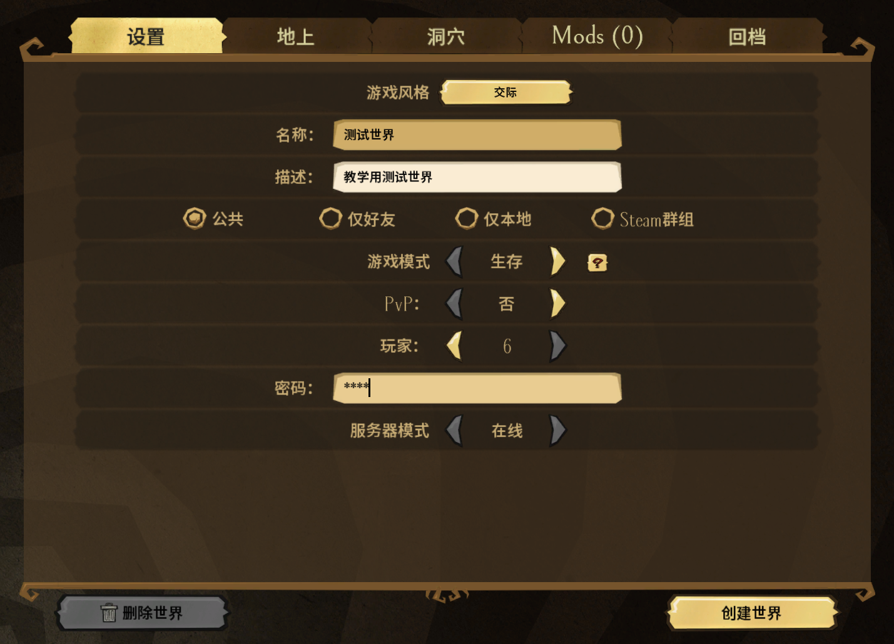
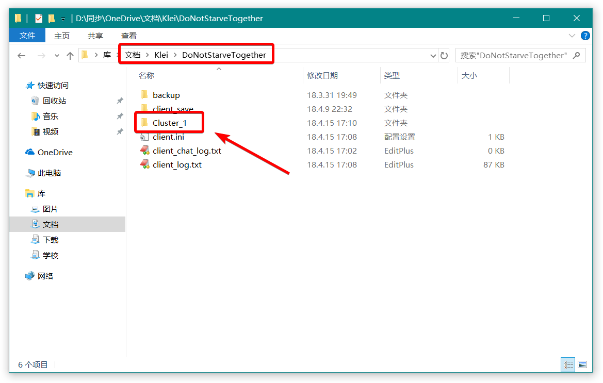
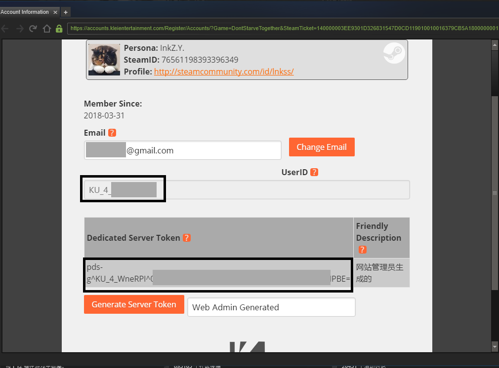

# Ubuntu Server 搭建饥荒服务端

> 平台：腾讯云
>
> 主机：标准型 S2 1核 2GB 50GB 1Mbps
>
> 操作系统：Ubuntu Server 16.04.1 LTS 64位

## 1.本地准备

> 2018.04.15 对配置部分进行修改，原内容已经迁移至文章末尾。我们将通过饥荒客户端获取到饥荒的世界配置文件，简单轻松。


（1）获取 UserID

点击个人资料（见上图的中的 1），在打开的界面中找到 UserID 值，记录下来（该值为你在饥荒中的人物 ID ）。

（2）配置地图

点击创建世界（见上图中的 2），进入图形化世界地图配置界面。如下图所示：


首先，指定了游戏风格：共四种类型，除了影响到服务器中世界图标外无其他作用。在指定完毕之后，进入到世界基本属性设置界面：



在这里，主要修改名称、描述和密码，他们影响到在世界列表中你的服务器描述，而密码则是服务器的钥匙。接下来配置地上和洞穴部分：

地上，对应 Master 部分，在该选项卡中可以具体的定制世界属性，比如指定世界大小，在服务器性能不足时调整世界大小也是一种选择。

洞穴，对应 Caves 部分，应为我们主要的目的是通过这个**图形化界面**获取到饥荒的属性配置，所以这里我们需要勾选添加世界。*我们在服务器上再指定是否启动地下。*


（3）安装 Mod

无 Mod ，不饥荒，玩饥荒怎么能确了他（*请根据服务器性能量力而行*）。

我们需要先在 Steam 创意工坊订阅好你所需要的 Mod ，然后在**服务端 Mod** 处勾选需要激活的 Mod ，见下图 1，同时对于提供了设置的 Mod ，可以点击螺丝图标配置其属性，见下图 2。


（4）运行世界

接下来，我们需要点击**创建世界**完成配置文件的生成。

点击创建世界，等待服务器启动，当出现人物选择界面时，无需进入游戏，直接点击**断开**即可。

（5）获取配置文件

对于 Windows 端的饥荒，此时的配置文件应该存放于你的文档目下的 Klei 目录里：

`C:\Users\你的用户名\Documents\Klei\DoNotStarveTogether`



具体到目录则是：`Cluster_X` ，X 取决于当前的地图存档数量。

我们复制该存档到桌面，删除一些无用的文件，确保删除后的文件结构为：

```file
.
└── Cluster_1
    ├── Caves
    │   ├── server.ini
    │   ├── modoverrides.lua
    │   └── leveldataoverride.lua
    ├── cluster.ini
    ├── cluster_token.txt
    └── Master
        ├── server.ini
        ├── modoverrides.lua
        └── leveldataoverride.lua
```

（6）简要的配置

* 我们需要为服务器指定管理员，在 Cluster_1 目录下，新建 `adminlist.txt` 文件，将前面获取到的 UserID复制到该目录。

* 应为在选择 MOD 时，我们是已经在创意工坊下载好了，但是在迁移到服务器后，服务器不知道，所以我们需要先告诉饥荒要下载那些 MOD 。

我们新建 `dedicated_server_mods_setup.lua` 文件（不放在 Cluster_1 目录里，另有他用），然后打开 Master 目录中的 modoverrides.lua 文件，在该文件中能够看到形如 `["workshop-347079953"]` 之类的字符，这里我们记录下后面的那串数字（数字对应的是 Mod 在创意工坊中的 ID）。

在 dedicated_server_mods_setup.lua 文件中写入 `ServerModSetup("347079953")` 。一行一个，把 modoverrides 中的按照这种形式写入到该文件中。

## 2.服务器操作

我们登录服务器，这里推荐 **Xshell** ，在其官网可以下载到免费的家庭/学生版本。

（1）安装环境依赖

```shell
sudo apt-get install libstdc++6:i386 libgcc1:i386 libcurl4-gnutls-dev:i386 lib32gcc1
```

（2） 安装 SteamCMD

```shell
mkdir ~/steamcmd
cd ~/steamcmd
wget https://steamcdn-a.akamaihd.net/client/installer/steamcmd_linux.tar.gz
tar -xvzf steamcmd_linux.tar.gz
```

（3）安装 DST 饥荒

```shell
./steamcmd.sh
```

此时进入 `steam>` 模式，依次输入：

```steam
login anonymous
force_install_dir ../dontstarvetogether_dedicated_server
app_update 343050 validate
quit
```

（4）解决 lib 缺失

```shell
mkdir -p ~/dontstarvetogether_dedicated_server/bin/lib32
ln -s /usr/lib/libcurl.so.4 libcurl-gnutls.so.4
```

（5）上传配置文件

首先，创建游戏文件夹

```shell
mkdir -p ~/.klei/DoNotStarveTogether
```

然后，通过 FTP 之类软件将步奏一中所准备的文件夹整体上传到 DoNotStarveTogether 目录下（也就是前文提到的 Cluster_1 目录）。

接下来上传 MOD 配置文件，还记得另有他用的 dedicated_server_mods_setup.lua 文件吗，我们将它上传到  `~/dontstarvetogether_dedicated_server/mods` 目录下（覆盖文件）。

FTP 类软件推荐使用 **XFtp** ，与 Xshell 是同一家公司产品，两个应用间可以非常方便的互相调用。

（6）制作启动脚本

回到家目录 `cd ~` ,在该目录下创建 `vim startDST.sh` 脚本，内容如下：

```sh
#!/bin/bash

steamcmd_dir="$HOME/steamcmd"
install_dir="$HOME/dontstarvetogether_dedicated_server"
cluster_name="Cluster_1"
dontstarve_dir="$HOME/.klei/DoNotStarveTogether"

check_for_file "$install_dir/bin"

cd "$install_dir/bin" || fail

run_shared=(./dontstarve_dedicated_server_nullrenderer)
run_shared+=(-console)
run_shared+=(-cluster "$cluster_name")
run_shared+=(-monitor_parent_process $$)

"${run_shared[@]}" -shard Caves  | sed 's/^/Caves:  /' &
"${run_shared[@]}" -shard Master | sed 's/^/Master: /'
```

赋于启动权限：

```shell
chmod +x ./startDST.sh
```

> 注意：
>
>* 脚本中最后两行代表了启动Caves和Master，两个实例大约共需要1.2G左右的内存，如果只玩地上部分，可以将含有Caves一行删除。
>
>* 脚本中的 cluster_name="Cluster_1" ，指的是存档的名称，通过修改这个值就可以启动不同的存档啦。

（7）启动游戏

利用 screen 命令启动一个新窗口，便于后台运行

```shell
screen -S DST
```

启动脚本文件

```shell
./startDST.sh
```

可通过 `Ctrl + A + D` 进入后台，通过 `screen -r DST` 返回窗口。

如果需要**验证服务器的状态**可以去参看资料中的第 7 个链接。

---

参考资料：

1. [【腾讯云linux（ubuntu）服务器安装饥荒专属服务器】](http://wsq.discuz.qq.com/?c=index&a=viewthread&f=inner&tid=22283&siteid=264281419)

1. [Linux 上搭建饥荒联机版 Don't Starve Together服务器](https://tianqing370687.github.io/2017/07/15/%E6%B8%B8%E6%88%8F-Linux-%E4%B8%8A%E6%90%AD%E5%BB%BA%E9%A5%A5%E8%8D%92%E8%81%94%E6%9C%BA%E7%89%88-Don-t-Starve-Together%E6%9C%8D%E5%8A%A1%E5%99%A8/)

1. [饥荒联机版独立服务器搭建踩坑记录](https://blessing.studio/deploy-dont-starve-together-dedicated-server/)

1. [在Centos7.3下开设一个饥荒服务器](https://sqh.me/tech/build-dont-starve-together-server-on-centos/)

1. [饥荒联机独立服务器搭建教程（三）：配置篇](http://blog.ttionya.com/article-1235.html)  <---有关地图配置的部分已过时

1. [饥荒联机版服务端MOD及更多设置](http://www.lyun.me/lyun/427) <---如果想打MOD可以参考

1. [Don't Starve Together Server List](http://my.jacklul.com/dstservers) <---在线验证服务器运行状况

---

## 老文章 - 仅供参考

> 2018.04.15 对配置部分进行修改，原内容已经迁移至文章末尾。附：该部分内容事实上**仍然可以参考**使用。缺点是需要手写配置，较为麻烦。

（1）获取cluster_token、UserID

打开饥荒联机版，点击游戏界面右下账户打开个人信息界面：



点击Generate Server Token获取cluster_token，同时也记录UserID值。

（2）游戏配置文件（本地进行）

* 在本地新建 `MyDediServer` 目录。

* 在 MyDediServer 目录下新建 `cluster_token.txt` 文件，将上一步获取到的cluster_token复制到文件内。

* 在 MyDediServer 目录下新建 `adminlist.txt` 文件，将上一步获取到的UserID复制到文件内。

* 在 MyDediServer 目录下新建 `cluster.ini` 文件，内容如下：

```ini
[GAMEPLAY]
max_players = 6
pvp = false
game_mode = endless
pause_when_empty = true
vote_kick_enabled = true

[NETWORK]
cluster_description = 服务器描述
cluster_name = 服务器名称
cluster_password = 服务器密码
cluster_intention = cooperative

[MISC]
max_snapshots = 6
console_enabled = true

[SHARD]
shard_enabled = true
bind_ip = 127.0.0.1
master_ip = 127.0.0.1
master_port = 10889
cluster_key = supersecretkey
```

* 在 MyDediServer 目录下新建 `Caves` 和 `Master` 目录

* 在 Caves 目录下新建 `server.ini` 文件，内容如下：

```ini
[NETWORK]
server_port = 11001

[SHARD]
is_master = false
name = Caves

[STEAM]
master_server_port = 27019
authentication_port = 8769

[ACCOUNT]
encode_user_path = true
```

* 在 Caves 目录下新建 `worldgenoverride.lua` 文件，内容如下：

```lua
return {
    override_enabled = true,
    preset = "DST_CAVE",
}
```

* 在 Master 目录下新建 `server.ini` 文件，内容如下：

```ini
[NETWORK]
server_port = 11000

[SHARD]
is_master = true

[STEAM]
master_server_port = 27018
authentication_port = 8768

[ACCOUNT]
encode_user_path = true
```

* 在 Master 目录下新建 `worldgenoverride.lua` 文件，内容如下：

```lua
return {
    override_enabled = true,
    preset = "SURVIVAL_TOGETHER",
}
```

截止到目前，你**应该拥有的目录结构**为：

```tree
.
└── MyDediServer
    ├── adminlist.txt
    ├── Caves
    │   ├── server.ini
    │   └── worldgenoverride.lua
    ├── cluster.ini
    ├── cluster_token.txt
    └── Master
        ├── server.ini
        └── worldgenoverride.lua
```