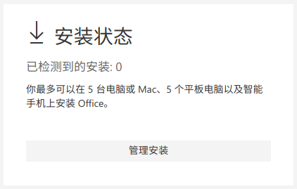
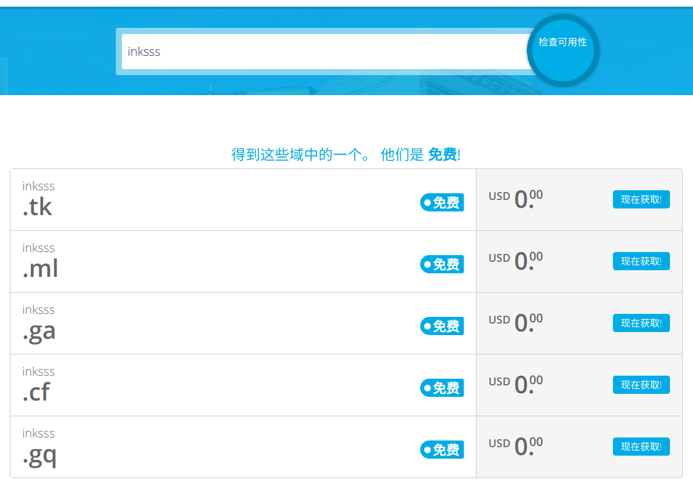
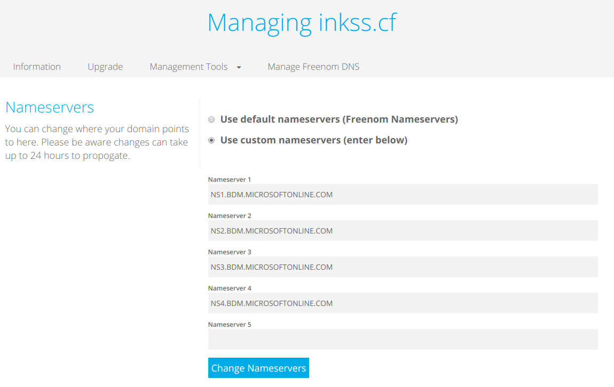

# Office 365 免费订阅申请

>  **Office 365 开发人员计划** ：通过这个计划可以免费申请到一年 `Office 365 企业版 E3（开发人员）` 订阅。

## 1.Office 365 开发人员计划

 :arrow_right: **相关链接**：[Office 365 开发者计划](https://developer.microsoft.com/zh-cn/office/dev-program)

申请过程这里不多阐述了，登录微软账户后按照提示操作即可，最终能够获得：

总共有 25 个账户，24 个可分配用户，每一个用户等同一个 Office 365 家庭版订阅。

## 2.设置 Office 域

在 **Microsoft 365 admin center** 界面，有一个被称作 **域** 的功能：

默认的域名为：`username.onmicrosoft.com` ，用户默认登录名则是：`xxxx.username.onmicrosoft.com` 。

本质上只是一个三级域名，长且繁琐，所以最好使用自己的域名。鉴于成本原因（外加不需要备案），此处推荐从   **Freenom** 处申请。

 :arrow_right: **相关链接**：[Freenom](https://www.freenom.com/zh/index.html)

可以在这个网站上 **以免费的价格申请到最长一年** 的域名（在域名到期前会发邮件通知）。

拿到域名后，回到 Office 设置，添加域信息即可（其中一步需要更改域名的 DNS 解析）。

在 Office 域中显示如下：

